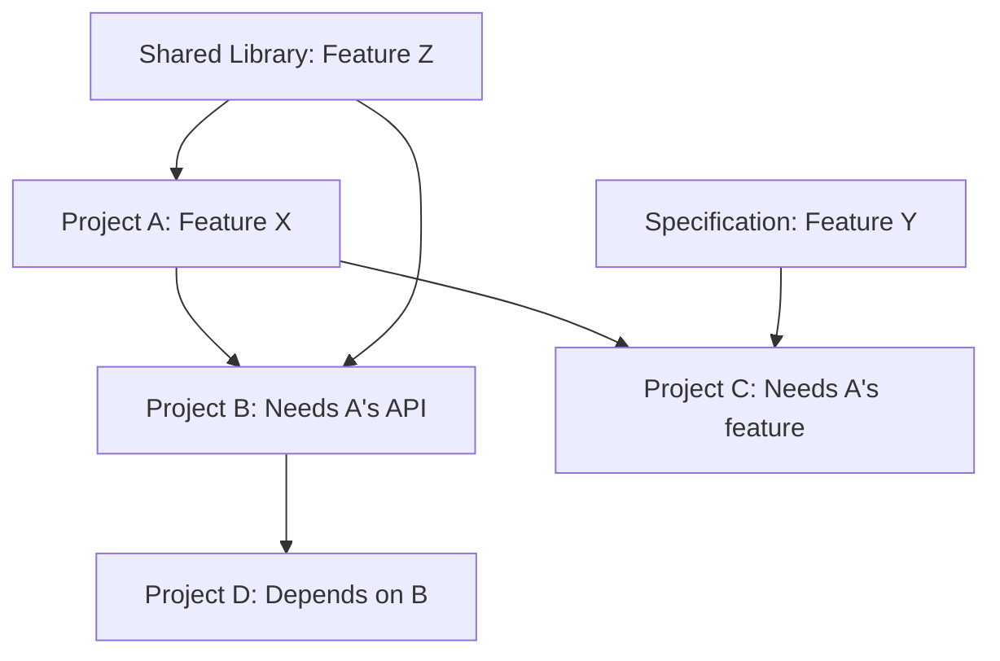

# Cross-Project Collaboration & OSS Foundations — Universal Reference

> A global reference on open source foundations, standards bodies, cross-project collaboration patterns, governance frameworks, legal structures, funding models, and conflict resolution. Applicable to any open source developer working across project boundaries.

**Version:** 1.0  
**License:** CC0-1.0 (public domain)  
**Maintainer:** Community maintain — open a PR to contribute corrections or additions.

---

## Table of Contents

1. [Part 1: OSS Foundations — Who They Are & What They Do](#part-1-oss-foundations--who-they-are--what-they-do)
2. [Part 2: Standards Bodies & Specifications](#part-2-standards-bodies--specifications)
3. [Part 3: Cross-Project Collaboration Patterns](#part-3-cross-project-collaboration-patterns)
4. [Part 4: Governance & Collaboration Tools](#part-4-governance--collaboration-tools)
5. [Part 5: Funding & Sponsorship of Collaboration](#part-5-funding--sponsorship-of-collaboration)
6. [Part 6: Legal Frameworks for Collaboration](#part-6-legal-frameworks-for-collaboration)
7. [Part 7: Conflict Resolution Between Projects](#part-7-conflict-resolution-between-projects)
8. [Part 8: Templates](#part-8-templates)

---

## Part 1: OSS Foundations — Who They Are & What They Do

### 1.1 Apache Software Foundation

The Apache Software Foundation (ASF) is the oldest and largest dedicated open source foundation, founded in 1999. It hosts over 300 projects and is built on the **Apache Way** — a set of principles emphasizing community over code, meritocratic governance, and vendor-neutrality.

#### Project Incubation

Every project entering the ASF goes through a formal **Incubation** process:

1. **Proposal:** A group of contributors proposes the project to the Apache Incubator PMC.
2. **Entry:** The Incubator PMC accepts the proposal and assigns mentors.
3. **Incubation:** The project operates under the Incubator's oversight. It must:
   - Migrate to Apache infrastructure (mailing lists, version control, issue tracker).
   - Adopt the Apache License 2.0.
   - Establish a Project Management Committee (PMC) following Apache governance.
   - Build a diverse, merit-based contributor community.
   - Release at least one incubation-period release.
4. **Graduation:** The Incubator PMC votes to graduate the project as a top-level project (TLP) or sub-project.

The average incubation period is 6–24 months. Some projects never graduate — they remain in the "podling" state or are retired.

#### Meritocracy Model

The ASF operates on **earned authority**:

| Role | How to Earn | Privileges |
|------|-------------|------------|
| User | Use the software | File bug reports, ask questions |
| Contributor | Submit patches, documentation, translations | +1 votes on code reviews |
| Committer | Sustained contribution quality + community vote | Direct commit access, vote in releases |
| PMC Member | Committer + elected by existing PMC | Vote on project direction, add/remove committers |
| ASF Member | Nominated by existing members, elected board-wide | Vote in board elections, foundation-level decisions |

Key principle: **If it happens at Apache, it happens on a mailing list.** All decisions are documented and archived. Private lists exist only for sensitive matters (security, personnel).

#### PMC Structure

Each top-level project has a **Project Management Committee (PMC)** :

```
ASF Board of Directors
  └── Each TLP's PMC (3+ members)
        ├── Committers (direct push access)
        ├── Contributors (occasional patches)
        └── Users
```

The PMC chair is appointed by the ASF board and reports periodically. The PMC is responsible for:
- Release management and quality
- Community health and growth
- Adding/removing committers
- Brand and trademark management
- Conformance with ASF policies

#### Key Projects

- **HTTP Server** (httpd) — the original project
- **Hadoop** — big data ecosystem (HDFS, MapReduce, YARN)
- **Spark** — unified analytics engine
- **Kafka** — distributed event streaming
- **Tomcat** — Java servlet container
- **Maven** — build automation
- **Lucene/Solr** — search platform
- **CloudStack** — cloud orchestration

---

### 1.2 Linux Foundation

The Linux Foundation (LF) is the umbrella organization that hosts the Linux kernel and hundreds of the most critical infrastructure projects. Unlike the ASF, the LF does not impose a single governance model — each hosted project defines its own.

#### Umbrella Structure

```
Linux Foundation
├── Core Projects
│   ├── Linux Kernel
│   ├── Git
│   └── OpenSSH
├── Collaborative Projects (sub-foundations)
│   ├── CNCF (Cloud Native Computing Foundation)
│   ├── LF AI & Data
│   ├── LF Edge
│   ├── OpenSSF (Open Source Security Foundation)
│   ├── OpenWallet Foundation
│   └── 20+ others
├── Training & Certification
│   ├── Linux Foundation Certified System Administrator (LFCS)
│   ├── Certified Kubernetes Administrator (CKA)
│   ├── FinOps Certified Practitioner
│   └── 50+ certification programs
├── LF Research
└── LF Live Events (KubeCon + CloudNativeCon, Open Source Summit, etc.)
```

#### Hosted Projects (selected)

| Project | Governance | Steered By |
|---------|-----------|------------|
| Linux Kernel | Linus Torvalds + maintainers | Subsystem maintainers |
| Kubernetes | SIGs + Steering Committee | Elected committee |
| Node.js | Technical Steering Committee | Individual members + corporate |
| ONAP | TSC + PTLs | Service providers + vendors |
| OpenDaylight | TSC + project leads | Network vendors |
| Hyperledger | TSC + maintainers | Enterprise blockchain |
| PyTorch Foundation | Governing Board | Meta + community |

#### Training & Certification

The Linux Foundation's training arm is one of its primary revenue sources. Certifications are vendor-neutral and widely respected:

| Certification | Focus | Exam Format |
|--------------|-------|-------------|
| CKA | Kubernetes administration | Hands-on terminal |
| CKAD | Kubernetes app development | Hands-on terminal |
| CKS | Kubernetes security | Hands-on terminal |
| LFCS | Linux system administration | Hands-on terminal |
| LFCA | Linux fundamentals | Multiple choice |
| FinOps | Cloud financial operations | Multiple choice |
| OpenJS Node.js | Node.js application development | Multiple choice |
| HCIA/HCIP | Hyperledger | Multiple choice |

#### Membership Tiers

| Tier | Annual Fee | Benefits |
|------|-----------|----------|
| Platinum | $500,000+ | Board seat, project representation |
| Gold | $100,000+ | Advisory board, marketing |
| Silver | $5,000–$50,000 | Logo placement, event discounts |
| Associate | Free | Non-profits, government |
| Individual | Free | Community member access |

---

### 1.3 CNCF (Cloud Native Computing Foundation)

The CNCF, a Linux Foundation sub-foundation, governs the cloud native ecosystem. It was founded in 2015 and now hosts over 170 projects.

#### Maturity Levels

Projects progress through three levels:

```
Sandbox (entry-level)
    ↓ (2+ TOC sponsors, 6+ months)
Incubating (growing)
    ↓ (adoption evidence, 2+ production users, security audit)
Graduated (mature)
```

**Sandbox Requirements:**
- At least 2 TOC sponsors
- A clear open source license
- Willingness to adopt CNCF governance
- No minimum adoption required

**Incubating Requirements:**
- Documented adoption (at least 2 production users from different orgs)
- Successful security audit
- Clear governance with committer diversity
- Active maintainer community (3+ from 2+ organizations)
- Completed IP review

**Graduated Requirements:**
- All incubating requirements, plus:
- CII Best Practices badge (passing)
- Comprehensive documentation in CNCF style
- 6+ months as incubating
- At least 3 production users from different orgs
- Governance documented and followed
- Explicit security disclosure process

#### TOC (Technical Oversight Committee) Structure

The TOC has 9 members:
- 3 elected by the CNCF community at large
- 3 elected from the top 20 contributors by commit count
- 3 appointed by the Governing Board

TOC responsibilities:
- Define and maintain the technical vision
- Approve new projects and maturity transitions
- Triage SIG and working group charters
- Arbitrate technical disputes between projects

#### Key Projects by Maturity

**Graduated (as of 2026):**
- Kubernetes
- Prometheus
- Envoy
- CoreDNS
- containerd
- Fluentd
- Jaeger
- Helm
- Harbor
- etcd
- Rook
- TiKV
- Cilium
- Vitess
- Linkerd
- Argo
- CloudEvents
- OpenTelemetry
- Flux
- Knative
- Strimzi
- Volcano
- Keda
- Dapr
- Backstage
- Kyverno

**Incubating:**
- KubeEdge
- K3s
- Crossplane
- Operator Framework
- KubeVirt
- Istio
- CRI-O
- Contour
- Pixie
- KEDA
- Litmus
- Chaos Mesh
- Keptn
- Kubevela
- KCL

**Sandbox (dynamic — check cncf.io/sandbox-projects):**
200+ projects at various stages

#### Governing Board

Composed of:
- 1 representative from each platinum member
- 1 representative from each gold member (up to 3 total)
- 1 representative from silver members (elected)
- 1 representative from the TOC
- 3 representatives from the community (end user)

---

### 1.4 Mozilla Foundation

The Mozilla Foundation, founded in 2003, is the non-profit that oversees the Mozilla Corporation (which builds Firefox, Pocket, and other products). Its mission: ensure the internet remains a global public resource, open and accessible.

#### Open Source Advocacy

Mozilla's advocacy work includes:
- **Mozilla Manifesto:** 10 principles for an open internet
- **Policy work:** Net neutrality, privacy regulation, encryption
- **Fellowship program:** Funding activists and researchers
- **Common Voice:** Crowdsourced voice dataset for speech technology
- **MDN Web Docs:** Industry-standard web development documentation
- **Rust and Servo:** Mozilla created Rust (now independent) and Servo (browser engine)

#### Leadership Model

```
Mozilla Foundation Board
    └── Mozilla Corporation (taxable subsidiary)
    │     ├── Firefox Engineering
    │     ├── Pocket
    │     ├── Mozilla VPN
    │     └── MDN Web Docs
    └── Mozilla Ventures (investment fund)
    └── Mozilla.ai (AI startup)
```

Key governance features:
- **Module ownership:** Code is divided into modules, each with an owner.
- **Peer review:** All changes must be reviewed by a module peer.
- **Super-review:** Complex changes require additional review by cross-module experts.
- **Mozilla Governance:** The foundation board appoints the corporation CEO.
- **Open design:** Major features go through public "intent to implement" and "intent to ship" phases.

---

### 1.5 Software Freedom Conservancy

The Software Freedom Conservancy (SFC) is a US 501(c)(3) non-profit that provides fiscal sponsorship and legal support for open source projects. Founded in 2006, it currently hosts about 40 projects.

#### Fiscal Sponsorship Model

Unlike foundations where projects join an existing organization, SFC acts as a **corporate home** for projects:

```
SFC Board of Directors
    └── Executive Director
    ├── Member Projects
    │   ├── Git
    │   ├── BusyBox
    │   ├── QEMU
    │   ├── Samba
    │   ├── Wine
    │   ├── Inkscape
    │   ├── Mercurial
    │   ├── Outreachy (internship program)
    │   └── 30+ others
    └── Legal & Compliance Team
```

Services provided:
- Legal entity for contracts, bank accounts, and IP
- Tax-deductible donation receipting (US)
- Financial management and accounting
- Legal representation for GPL enforcement
- Conference and event administration
- Trademark protection

#### GPL Enforcement

SFC is the most active GPL enforcement organization. Their approach:

1. **Notification:** Contact the violator with a detailed compliance report.
2. **Verification:** Request complete corresponding source code.
3. **Negotiation:** Work toward compliance without litigation.
4. **Publication:** If negotiation fails, public disclosure.
5. **Litigation:** File lawsuit as last resort (e.g., Vizio case, 2018–2021).

SFC holds that GPL enforcement is not anti-business — it ensures the license works as intended.

| Enforcement Case | Year | Outcome |
|-----------------|------|---------|
| BusyBox vs. Monsoon Multimedia | 2009 | Settlement + compliance |
| BusyBox vs. Samsung | 2009 | Settlement + compliance |
| BusyBox vs. Verizon FIOS (Actiontec) | 2008 | Settlement + compliance |
| SFC vs. Vizio (GPL on SmartCast TVs) | 2018–2021 | Settlement + source code provision |
| SFC vs. Huawei | 2021 | Compliance achieved |
| SFC vs. Westinghouse | 2022 | Compliance achieved |

---

### 1.6 Python Software Foundation

The Python Software Foundation (PSF) governs the Python programming language. Founded in 2001, it is a US 501(c)(3) non-profit.

#### PEP Process

Python's evolution is governed by the **Python Enhancement Proposal (PEP)** process:

| Stage | Description | Gate |
|-------|-------------|------|
| Idea | Discuss on python-ideas or Discourse | None |
| Draft | Write PEP, submit to python-dev | None |
| Discussion | Community review on python-dev | PEP editor assigns number |
| Accepted | BDFL-delegate or Steering Council approves | Steering Council vote |
| Final | Implementation complete | PEP merged |
| Provisional | Experimental, may be tweaked | Limited-time acceptance |
| Superseded | Replaced by newer PEP | None |
| Rejected | Declined | Never revisited |
| Withdrawn | Author withdrew | None |

**PEP 1** defines the PEP process itself. It has been amended many times.

**Current governance model** (PEP 13, adopted 2018):
- **Steering Council:** 5 elected members, serve 2-year terms. Approves PEPs, resolves disputes.
- **Core developers:** Committers with voting rights in Steering Council elections.
- **BDFL-delegate:** The Steering Council may delegate authority on specific PEPs.
- **PEP editors:** Core developers who manage the PEP repository.

#### Core Developer Model

Becoming a Python core developer:

1. **Sustained contributions** (patches, reviews, triage, documentation).
2. **Vote by existing core developers** — must be open and anonymous.
3. **Grant commit access** to the CPython repository.
4. **Rights:** vote in Steering Council elections, propose PEPs, commit code.
5. **Responsibilities:** review others' code, follow governance, uphold community standards.

There are approximately 125 active core developers.

| Role | Privileges | Number (approx.) |
|------|-----------|-----------------|
| BDFL (Guido van Rossum) | Ultimate authority (retired 2018) | 1 |
| Steering Council | Governance authority | 5 |
| Core Developer | Commit access, vote | 125 |
| Triage Team | Issue management | 50+ |
| Contributors | Patches, reviews | Thousands |

#### Language Governance Timeline

| Year | Change |
|------|--------|
| 2000 | BDFL model (Guido van Rossum) |
| 2004 | PEP process formalized (PEP 1) |
| 2012 | Python 2 EOL announced |
| 2018 | Guido steps down as BDFL |
| 2019 | Steering Council elected (PEP 13) |
| 2020 | Python 2 EOL |
| 2023 | PEP 13 amended for term limits |

---

### 1.7 Rust Foundation

The Rust Foundation was formed in 2021 as a US 501(c)(6) non-profit (membership organization). It was created by AWS, Google, Meta, Microsoft, Huawei, and Mozilla.

#### Team Model

Rust's governance uses a **team model**:

```
Rust Foundation Board
    └── Project Director (appointed by Foundation)
    └── Leadership Council
        ├── Core Team
        │   ├── Compiler Team
        │   ├── Language Team
        │   ├── Library Team
        │   ├── Infrastructure Team
        │   ├── Release Team
        │   ├── Dev Tools Team
        │   └── 10+ other teams
        ├── Moderation Team
        ├── Governance Team
        └── Project teams
```

Each team has:
- **Leads:** 1–2 people responsible for coordination
- **Members:** Active contributors with decision authority
- A Rust Foundation member (paid by Foundation) serving as project director

The **Leadership Council** (replaced the old Core Team in 2023) handles cross-cutting decisions, budget, and representation.

#### RFC Process

Rust uses a formal RFC process inspired by Python's PEP:

```
RFC 0001: RFC Process
RFC 0002: Package naming conventions
RFC 0010: Pattern matching
RFC 0430: Final syntax for box patterns
RFC 2000: Const generics
RFC 2492: Async traits
RFC 3200: GATs
```

**RFC pipeline:**

1. **Pre-RFC discussion** on internals.rust-lang.org or Zulip.
2. **Submit RFC** as a pull request to the rust-lang/rfcs repository.
3. **FCP (Final Comment Period):** 10 calendar days for final input.
4. **Team decision:** Accept, reject, or postpone.
5. **Tracking issue:** Implementation tracked with `@rustbot` labels.

Major RFCs (those affecting language syntax or standard library) require **super-majority** of the relevant team.

#### Crate Ecosystem

The **crates.io** package registry is managed by the Infrastructure Team. Key stats:

| Metric | Value |
|--------|-------|
| Crates published | 170,000+ |
| Downloads | 50+ billion |
| Active maintainers | 300+ (crates.io team) |
| Top 10 crates | serde, tokio, regex, clap, rayon, axum, actix, rocket, diesel, tauri |

The crate ecosystem uses **semantic versioning** with a twist: pre-1.0 crates (0.x.y) behave differently — minor versions can contain breaking changes, which has caused the "dependency deadlock" problem in the ecosystem.

---

### 1.8 Eclipse Foundation

The Eclipse Foundation, founded in 2004, is a vendor-neutral organization that hosts the Eclipse IDE and hundreds of other projects. It moved from the Eclipse Public License (EPL) to a Europe-based governance model (Belgian non-profit).

#### IP Management

Eclipse has the most rigorous IP management process among the major foundations:

1. **Contribution Questionnaire (CQ):** Every third-party dependency must be approved.
2. **IP Log:** Maintained for every release, listing all contributions.
3. **Release Review:** Formal review before every release.
4. **License clearance:** Required for all dependencies — any license must be vetted.
5. **Due diligence:** Automated scanning (Dash License Tool, IPZilla).

This process is thorough but slow — it can take weeks to approve a new dependency.

#### Specification Process

Eclipse is also a **JSR (Java Specification Request) submitter** and hosts the **Jakarta EE** specification process:

1. **Specification Proposal (SP):** Initial concept.
2. **Draft Specification:** Developed in an open GitHub repository.
3. **Final Specification:** Approved by the Specification Committee.
4. **Compatibility Test Kit (TCK):** Required for implementations to claim compatibility.

Each specification has:
- A **Specification Project** (defines the spec)
- An **Implementation Project** (reference implementation)
- A **Compatibility Test Kit Project** (tests)

#### Membership

| Tier | Annual Fee | Eligibility |
|------|-----------|-------------|
| Strategic Member | €20,000+ | Board seat, IP committee |
| Contributing Member | €5,000–€20,000 | Advisory board |
| Associate Member | €500–€5,000 | SME/non-profit |
| Committer Member | Free | Active project committers |
| Guest Member | Free | Non-profits, academia |

---

### 1.9 OpenJS Foundation

The OpenJS Foundation, formed in 2019 from the merger of the JS Foundation and Node.js Foundation, is the Linux Foundation sub-foundation for JavaScript ecosystem projects.

#### Governance Model

```
OpenJS Foundation Board of Directors
    └── Cross-Project Council (CPC)
        ├── Voting Members (project representatives)
        │   ├── App Ecosystem (Appium, WebDriver.io)
        │   ├── Web Framework (Dojo, jQuery, Mocha)
        │   ├── Runtime (Node.js)
        │   └── Standards (ECMA TC39 liaison)
        └── Non-Voting Members (observer projects)
```

The **CPC** makes technical decisions, oversees code of conduct, and manages infrastructure.

#### Impact Project Status

Projects can earn **Impact Project** status by demonstrating:
- Large, diverse user base
- Active maintainer team (5+ from 3+ organizations)
- Governance documented and followed
- Security policy in place
- 6+ months as an OpenJS project

| Impact Projects | Stage |
|----------------|-------|
| Node.js | Impact |
| jQuery | Impact |
| Appium | Impact |
| WebDriver.io | Impact |
| Mocha | Impact |
| ESLint | Impact |
| Lodash | Impact |
| Grunt | Impact |

---

### 1.10 Foundation Comparison Table

| Foundation | Focus Area | Governance Model | Projects | Budget Model | How to Join |
|-----------|-----------|-----------------|----------|-------------|-------------|
| Apache Software Foundation | General OSS | Meritocracy, PMC | 320+ | Corporate sponsorship + donations | Submit incubation proposal |
| Linux Foundation | Infrastructure, Linux | Per-project (flexible) | 500+ | Corporate members + training | Form collaborative project |
| CNCF | Cloud Native | TOC + maturity levels | 170+ | Corporate members (LF sub) | Sandbox application |
| Mozilla Foundation | Internet, browser | Module ownership | 50+ | Product revenue (Firefox) | Become contributor, join module |
| Software Freedom Conservancy | Copyleft, fiscal | Fiscal sponsorship | 40+ | Donations + enforcement | Apply for membership |
| Python Software Foundation | Python language | Steering Council | 1 (CPython) | Sponsors + PyCon + donations | Become core developer |
| Rust Foundation | Rust language | Team model + Council | 1 (Rust) | Corporate members | Join a team |
| Eclipse Foundation | Enterprise Java, IoT | IP-heavy, specification | 400+ | Corporate members | Create project proposal |
| OpenJS Foundation | JavaScript ecosystem | CPC + Impact stages | 30+ | Corporate members (LF sub) | Project proposal to CPC |
| OpenSSF | Security | SIGs + TAC | 100+ | Corporate members (LF sub) | Join a SIG |
| OpenInfra Foundation | Cloud infrastructure | Technical Committee | 30+ | Corporate members | Project proposal |
| Financial Consortium (FINOS) | Financial services | SIGs + TAC | 50+ | Member firms | Corporate membership |

---

## Part 2: Standards Bodies & Specifications

### 2.1 IETF (Internet Engineering Task Force)

The IETF is the primary standards development organization for the internet. It operates under the Internet Society (ISOC) and is responsible for core protocols: TCP/IP, HTTP, TLS, DNS, and thousands more.

#### RFCs

Every IETF standard is published as an **RFC** (Request for Comments):

| RFC Category | Description | Example |
|-------------|-------------|---------|
| Standards Track | Protocol specification | RFC 2616 (HTTP/1.1) |
| Best Current Practice (BCP) | Operational guidance | BCP 14 (RFC 2119 key words) |
| Informational | General information | RFC 1149 (IP over Avian Carriers) |
| Experimental | Prototype specification | RFC 2544 (benchmarking) |
| Historic | Obsolete or never deployed | RFC 0951 (obsolete) |

**RFC numbering:**
- RFCs are numbered sequentially (RFC 1 is from 1969).
- Current number: ~9,600 (May 2026).
- Each RFC is immutable once published. Updates are new RFCs that may obsolete, update, or extend prior ones.
- STD numbers: Some RFCs are grouped into "STD" numbers (e.g., STD 7 is the IP suite).
- BCP numbers: Best Current Practices get BCP numbers (e.g., BCP 14).

#### Working Groups

```
IETF Area         (1–2 Area Directors)
    └── Working Groups  (chairs + participants)
        ├── Documents  → (proposed standard → draft standard → internet standard)
        └── Milestones → (target dates for WG deliverables)
```

**IETF Areas (2026):**

| Area | Focus | Example WGs |
|------|-------|-------------|
| Applications and Real-Time (ART) | Application protocols | HTTPBIS, QUIC, WebRTC |
| Internet (INT) | Network layer | IPv6, 6MAN, DNSOP |
| Operations and Management (OPS) | Network operations | NETCONF, YANG, MBONED |
| Routing (RTG) | Routing protocols | BESS, IDR, LSR, PIM |
| Security (SEC) | Security protocols | TLS, CFRG, OAuth |
| Transport (TSV) | Transport protocols | TCPM, TSVWG |
| General (GEN) | Cross-cutting | IESG, IAB process |

#### How to Participate

1. **Read the Tao of the IETF** (BCP 95) — mandatory first step.
2. **Subscribe to working group mailing lists** — discussion happens here, not at meetings.
3. **Attend an IETF meeting** (3 per year, in-person + remote).
4. **Write an Internet-Draft** (I-D) — the prerequisite to an RFC.
5. **Present at a WG session** — get feedback from experts.
6. **Rough consensus and running code** — the IETF mantra. Decisions are based on rough consensus, not voting.

**IETF meetings:**
- 3 per year (one in Asia, one in Europe, one in North America).
- ~1,200 participants each.
- Free or low-cost registration.
- Remote participation is fully supported (Meetecho).

**IETF Standards Process:**

```
Personal I-D → WG I-D (adopted) → WG Last Call → IETF Last Call → IESG Review → RFC Editor → Published RFC
```

Each step can send the document back for revision. The average Standards Track RFC takes 2–4 years from first I-D to publication.

---

### 2.2 W3C (World Wide Web Consortium)

The W3C is the primary standards body for the World Wide Web. Founded in 1994 by Tim Berners-Lee, it operates as a consortium of member organizations.

#### Web Standards

The W3C produces **Web Standards** (previously called "W3C Recommendations"):

| Standard | Purpose | Current Version |
|----------|---------|----------------|
| HTML | Core web markup | HTML 5.2 (2017) / HTML Living Standard (WHATWG) |
| CSS | Visual presentation | CSS3 (modular) |
| DOM | Document Object Model | DOM4 (2015) |
| XML | Extensible Markup Language | XML 1.1 (2006) |
| SVG | Scalable Vector Graphics | SVG 2 (2018) |
| WebAssembly | Binary instruction format | WASM 2.0 (2023) |
| WCAG | Web Content Accessibility Guidelines | WCAG 2.2 (2023) |
| RDF | Resource Description Framework | RDF 1.1 (2014) |
| OWL | Web Ontology Language | OWL 2 (2012) |
| SPARQL | SPARQL Protocol and RDF Query Language | SPARQL 1.1 (2013) |

#### Working Groups

```
W3C Advisory Board
    └── W3C Director (Tim Berners-Lee)
        └── W3C Team (full-time staff)
            └── Working Groups
                ├── HTML Working Group (now WHATWG)
                ├── CSS Working Group
                ├── Web Applications Working Group
                ├── Accessibility Guidelines Working Group
                ├── Web Payments Working Group
                ├── DID Working Group (Decentralized Identifiers)
                └── 10+ other WGs
```

Each WG has:
- A **charter** defining scope and deliverables (time-limited, typically 2 years).
- A **chair** (or co-chairs) who run meetings.
- **W3C Team contacts** (staff liaisons).
- **Participants** from member organizations.

#### Recommendation Track

```
Working Draft (WD)
    ↓ (at least 2 WDs)
Candidate Recommendation (CR)
    ↓ (implementation feedback)
Proposed Recommendation (PR)
    ↓ (W3C Advisory Committee review)
W3C Recommendation (REC)
    ↓ (maintenance)
Edited Recommendation
```

**Key milestones:**
- **First Public Working Draft (FPWD):** First public airing.
- **Candidate Recommendation (CR):** Feature-complete, seeking implementation.
- **Proposed Recommendation (PR):** Final review by W3C members.
- **Recommendation (REC):** Final standard.

The **W3C Patent Policy** requires all WG participants to commit to royalty-free licensing for essential patents covering their contributions.

#### WHATWG & The HTML Living Standard

In 2004, browser vendors (Apple, Mozilla, Opera) formed the **WHATWG** when they felt W3C was moving too slowly on HTML. WHATWG produces:
- **HTML Living Standard** (not versioned)
- **DOM Living Standard**
- **Fetch Living Standard**
- **URL Living Standard**

In 2019, W3C and WHATWG agreed to a **Memorandum of Understanding**: WHATWG would be the sole source for HTML and DOM standards, and W3C would be the primary venue for patent policy.

---

### 2.3 ISO/IEC JTC 1

ISO/IEC JTC 1 is the joint technical committee of ISO and IEC for information technology standards.

#### Structure

```
ISO (Geneva) ──┬── JTC 1 ──┬── Subcommittees (SCs)
                │           │     ├── SC 22: Programming languages (C, C++, SQL, etc.)
                │           │     ├── SC 27: Security techniques
                │           │     ├── SC 28: Office equipment
                │           │     ├── SC 29: Coding of audio, picture, multimedia (JPEG, MPEG)
                │           │     ├── SC 31: Automatic identification (bar codes, RFID)
                │           │     ├── SC 32: Data management (SQL)
                │           │     ├── SC 34: Document description (OOXML, ODF)
                │           │     ├── SC 35: User interfaces
                │           │     ├── SC 36: Learning technology
                │           │     ├── SC 37: Biometrics
                │           │     ├── SC 38: Cloud computing
                │           │     ├── SC 39: Sustainability for IT
                │           │     ├── SC 40: IT service management
                │           │     ├── SC 41: Internet of Things
                │           │     ├── SC 42: Artificial Intelligence
                │           │     └── SC 43: Quantum computing
                │           └── Working Groups (WGs)
                │                 ├── WG 7: JPEG
                │                 ├── WG 11: MPEG
                │                 └── WG 14: C++ (via SC 22/WG 21)
                └── National Bodies (P-members = voting, O-members = observing)
```

#### Formal Standards Process

```
New Proposal (NP)
    ↓ (vote by P-members)
Working Draft (WD)
    ↓ (multiple iterations)
Committee Draft (CD)
    ↓ (vote)
Draft International Standard (DIS)
    ↓ (vote)
Final Draft International Standard (FDIS)
    ↓ (vote)
International Standard (IS)
```

**Timeline:** 3–5 years average for a full standard.

**Key programming language standards under JTC 1:**

| Language | Standard | ISO SC/WG |
|----------|---------|-----------|
| C | ISO/IEC 9899 | SC 22/WG 14 |
| C++ | ISO/IEC 14882 | SC 22/WG 21 |
| SQL | ISO/IEC 9075 | SC 32/WG 3 |
| COBOL | ISO/IEC 1989 | SC 22/WG 4 |
| Fortran | ISO/IEC 1539 | SC 22/WG 5 |
| Ada | ISO/IEC 8652 | SC 22/WG 9 |
| Prolog | ISO/IEC 13211 | SC 22/WG 17 |
| Ruby (ISO) | ISO/IEC 30170 | SC 22 (withdrawn) |
| JavaScript (ECMAScript) | ECMA-262 (not ISO) | ECMA TC39 |

#### How to Participate in ISO Standards

1. **Join a national body** (e.g., ANSI in US, BSI in UK, DIN in Germany, AFNOR in France).
2. **Attend their JTC 1 mirror committee** meetings.
3. **Become a delegate** to international meetings.
4. **Submit contributions** through your national body.

**Cost:** Usually free if you represent a company or academic institution. Individuals can join as "experts" via their national body.

---

### 2.4 OASIS

OASIS (Organization for the Advancement of Structured Information Standards) is a non-profit consortium that develops open standards for:

- **Security:** SAML, XACML, KMIP, PKCS 11
- **Cloud:** TOSCA, CAMP
- **Legal:** LegalDocML, Akoma Ntoso (legislative documents)
- **Emergency management:** CAP (Common Alerting Protocol), EDXL
- **Content management:** CMIS, DITA
- **IoT:** MQTT, AMQP

#### Standards Process

```
Working Draft → Committee Specification Draft → Committee Specification → OASIS Standard
```

Each stage requires:
- Public review period (30–60 days)
- Minimum of 3 statements of use from implementers
- Approval by the Technical Committee

#### Key Differences from Other Bodies

| Feature | OASIS | W3C | IETF | ISO |
|---------|------|-----|------|-----|
| Focus | Industry consortia | Web | Internet | Formal IT |
| Membership fee | $5K–$150K | $25K–$100K | Free | Through national body |
| Patent policy | RF + FRAND options | RF mandatory | RF mandatory | FRAND |
| Time to standard | 12–18 months | 2–4 years | 2–4 years | 3–5 years |
| Implementations | 3 statements of use required | 2+ implementations | Running code | Conformance testing |

---

### 2.5 OpenAPI Initiative

The OpenAPI Initiative (OAI) is a Linux Foundation project that governs the **OpenAPI Specification** (formerly Swagger).

#### Governance

```
OAI Governing Board
    └── Technical Steering Committee (TSC)
        └── Specification Editors
        └── Working Groups
            ├── OpenAPI Specification WG
            ├── Tooling WG
            ├── Community WG
            └── Outreach WG
```

The TSC has representatives from:
- Google, IBM, Microsoft, Postman, SmartBear, Capital One
- Individual community-elected members
- The specification editors

#### Specification Versions

| Version | Year | Key Features |
|---------|------|-------------|
| 2.0 (Swagger) | 2014 | Original spec, widely adopted |
| 3.0.0 | 2017 | Major redesign: reusable components, linked examples, callbacks, server variables |
| 3.0.1 | 2017 | Clarifications, bug fixes |
| 3.0.2 | 2018 | Further clarifications |
| 3.0.3 | 2020 | Minor fixes |
| 3.1.0 | 2021 | JSON Schema compatibility, webhooks, license/identifier fields |
| 3.1.1 | 2024 | Bug fixes, clarifications |

---

### 2.6 OWASP

The Open Web Application Security Project (OWASP) is a non-profit focused on improving software security. It produces:

#### Key Standards & References

| Resource | Description |
|----------|-------------|
| **OWASP Top 10** | Most critical web application security risks (updated ~4 years) |
| **ASVS** | Application Security Verification Standard — detailed security requirements |
| **MASVS** | Mobile Application Security Verification Standard |
| **SAMM** | Software Assurance Maturity Model — organizational security |
| **Cheat Sheet Series** | Concise security guidance for specific topics |
| **ZAP** | Zed Attack Proxy — automated web security scanner |
| **Dependency-Check** | SCA tool for known vulnerabilities |
| **WebGoat** | Deliberately vulnerable web application for training |
| **Juice Shop** | Modern vulnerable web app for training |

#### OWASP Top 10 (2021)

| Rank | Category |
|------|----------|
| A01 | Broken Access Control |
| A02 | Cryptographic Failures |
| A03 | Injection |
| A04 | Insecure Design |
| A05 | Security Misconfiguration |
| A06 | Vulnerable and Outdated Components |
| A07 | Identification and Authentication Failures |
| A08 | Software and Data Integrity Failures |
| A09 | Security Logging and Monitoring Failures |
| A10 | Server-Side Request Forgery (SSRF) |

#### Governance

OWASP is organized as a **membership association**:
- **Members:** Paying individuals ($50/year)
- **Board of Directors:** 7 elected members
- **Staff:** Small full-time team
- **Chapters:** Local groups (250+ worldwide)
- **Projects:** Community-led, no formal graduation process

---

### 2.7 Joint Development Foundation

The Joint Development Foundation (JDF) is the Linux Foundation's vehicle for launching standards organizations without creating new legal entities.

#### How It Works

```
Project creates a specification
    ↓
Project applies to JDF
    ↓
JDF provides legal infrastructure
    ↓
Project publishes through JDF → ISO/IEC JTC 1 PAS submission
```

**Benefits of JDF sponsorship:**
- Immediate legal entity (no need to incorporate)
- Ready-made IPR policy (RF, FRAND, or proprietary)
- ISO/IEC JTC 1 PAS (Publicly Available Specification) submission path
- Linux Foundation administrative support
- Trademark management

**Projects using JDF:**
- OpenAPI Initiative (now independent)
- GraphQL Foundation
- Joint Development Foundation Projects, LLC (umbrella)
- C2PA (Coalition for Content Provenance and Authenticity)
- JDF-fed projects can submit to ISO/IEC JTC 1 under the **PAS transposition process**.

---

### 2.8 How to Get Your Project's Specification Standardized

| Path | Body | Time | Cost | Requirements |
|------|------|------|------|-------------|
| Community spec | IETF | 2–4 years | Free | WG adoption, rough consensus |
| Web standard | W3C | 2–4 years | Member fee | WG charter, 2+ implementations |
| Formal standard | ISO/IEC | 3–5 years | National body fee | National body sponsorship |
| Industry standard | OASIS | 12–18 months | Member fee | 3+ implementers |
| De facto + standardization | OpenAPI path | 1–2 years | LF membership | Existing adoption + foundation |
| Fast-track | JDF → ISO PAS | 6–12 months | LF membership | Mature specification |
| Direct submission | ISO/IEC PAS | 6–12 months | $10K–$50K | Approved PAS submitter | 

#### Decision Tree

```
Is your spec deployed in multiple implementations?
    ├── YES → Do you need formal ISO recognition?
    │         ├── YES → Is your foundation an ISO PAS submitter?
    │         │         ├── YES → JDF PAS path (fastest)
    │         │         └── NO  → National body → ISO JTC 1
    │         └── NO  → IETF (internet) or W3C (web)
    └── NO  → Build adoption first, then standardize
```

---

## Part 3: Cross-Project Collaboration Patterns

### 3.1 Shared Dependency Maintenance

Many projects depend on the same critical libraries. Joint maintenance reduces duplicate effort and improves security posture.

#### Pattern: Shared Maintainer Teams

```
openssl/openssl          zlib/zlib               curl/curl
    │                       │                         │
    └───────────────────────┼─────────────────────────┘
                            │
              Core Infrastructure Initiative (CII)
              Now: OpenSSF (Linux Foundation)
```

**Examples:**

| Library | Consumers | Maintainer Team | Funding |
|---------|-----------|----------------|---------|
| OpenSSL | 90%+ of web servers | OpenSSL Foundation | Linux Foundation, AWS, Akamai, individual donations |
| zlib | Every Linux distribution | Small team (2–3 maintainers) | Open Source Collective |
| curl | Every operating system | Daniel Stenberg + ~15 committers | curl Foundation (WolfSSL) + corporate sponsors |
| libxml2 | 1000s of projects | Daniel Veillard + GNOME team | Red Hat pays salary |
| sqlite | Every smartphone, browser | D. Richard Hipp + team | sqlite.org (selling extensions) |
| libffi | Python, Ruby, many others | Anthony Green + small team | FSF, Red Hat |
| OpenBLAS | NumPy, SciPy, Julia | Community team | NSF, NumFOCUS, donations |

**Funding sources for shared dependencies:**
- **OpenSSF:** Underwrite security audits for critical libraries
- **LF Core Infrastructure Initiative:** (historic) Funded OpenSSL fuzzing, curl, etc.
- **Corporate secondment:** Companies pay employees to maintain shared deps (Red Hat for glibc, Google for OpenSSL)
- **Donations through fiscal sponsors:** curl → curl Foundation, zlib → Open Source Collective

#### Pattern: Centralized Vulnerability Management

```
CVE Reporting ←── Project-specific security@ lists
    │                     │
    ├── OpenSSF                    └── Individual projects
    │   ├── OSS-Fuzz (Google)          ├── Patch development
    │   ├── Scorecard                   ├── Embargo period
    │   ├── GUAC                        └── Coordinated disclosure
    │   └── Sigstore
    │
    └── GitHub Advisory Database
```

---

### 3.2 Common Specification Implementation

When multiple projects implement the same specification, coordination is essential.

#### Specification → Multiple Implementations

```
Specification Body
    ├── Reference Implementation (RI)
    ├── Alternative Implementation A
    ├── Alternative Implementation B
    └── Conformance Test Suite (CTS)
```

**Case study: Kubernetes Container Runtime Interface (CRI)**

```
Kubernetes CRI Spec
    ├── containerd (graduated CNCF)
    │   ├── Docker via dockershim (deprecated)
    │   └── Direct (default since k8s 1.24)
    ├── CRI-O (incubating CNCF)
    │   └── Default on OpenShift
    └── Kata Containers (sandbox CNCF)
        └── Hardware-virtualized containers
```

**How they collaborate:**
- CRI specification is in the Kubernetes repository itself.
- containerd and CRI-O maintainers participate in Kubernetes SIG-Node.
- CRI conformance tests are in the kubernetes-sigs/cri-tools repo.
- Joint releases tested in the CNCF CI pipeline (k8s + containerd + CRI-O).

**Case study: OpenTelemetry**

```
OpenTelemetry Specification (CNCF)
    ├── OpenTelemetry Collector
    ├── SDK implementations:
    │   ├── opentelemetry-java
    │   ├── opentelemetry-python
    │   ├── opentelemetry-go
    │   ├── opentelemetry-js
    │   ├── opentelemetry-dotnet
    │   ├── opentelemetry-rust
    │   ├── opentelemetry-cpp
    │   └── 8+ more languages
    ├── Automatic instrumentations:
    │   ├── Java agent
    │   ├── Python agent
    │   └── .NET agent
    └── Exporter contributions:
        ├── Prometheus
        ├── Jaeger
        ├── Zipkin
        └── Vendor-specific (Datadog, New Relic, etc.)
```

**Coordination mechanisms:**
- **SIGs** (Special Interest Groups): Java SIG, Python SIG, .NET SIG, Collector SIG
- **Cross-language specification meetings:** Monthly
- **Specification change RFC:** Must be approved by the OpenTelemetry TSC
- **Compliance matrix:** Tracking which SDKs implement which parts of the spec

---

### 3.3 Interoperability Testing

Cross-project CI/CD is essential to ensure projects work together.

#### Conformance Suites

| Suite | Standard | Projects Tested | Frequency |
|-------|----------|-----------------|-----------|
| Kubernetes Conformance | K8S API | 100+ distributions | Per release |
| CNCF Certified Kubernetes | K8S API | 100+ | Per version |
| OpenTelemetry Compliance | OTel spec | All 11 SDKs | Per SDK release |
| W3C Validation | HTML, CSS, SVG | All browsers | Continuous |
| CVE consistency | VEX, CSAF | Tooling vendors | Per tool release |

#### Cross-Project CI Patterns

**Pattern: Downstream CI**

```yaml
# Example: NumPy tests against proposed changes to CPython
# Location: NumPy's CI config
name: Test against Python main branch
on:
  schedule:
    - cron: '0 6 * * *'  # daily
  workflow_dispatch:

jobs:
  test-numpy-main:
    runs-on: ubuntu-latest
    strategy:
      matrix:
        python-version: ['3.12', '3.13-dev']
    steps:
      - uses: actions/checkout@<sha>  # v4
      - uses: actions/setup-python@<sha>  # v5
        with:
          python-version: ${{ matrix.python-version }}
      - name: Install numpy
        run: |
          pip install cython pybind11
          pip install -e .
      - name: Run tests
        run: |
          python -m pytest tests/
          # Report failures to cross-project tracker
      - name: Report failures to Python tracker
        if: failure() && matrix.python-version == '3.13-dev'
        run: |
          python .github/report_upstream_failure.py \
            --upstream https://github.com/python/cpython \
            --label "numpy-downstream"
```

**Pattern: Cross-Project Test Matrix**

```yaml
# Example: containerd tests against multiple CRI runtimes
# and Kubernetes versions
name: containerd CRI compatibility
on:
  pull_request:
    paths:
      - 'pkg/cri/**'

jobs:
  cri-compat:
    strategy:
      matrix:
        kubernetes: ['1.27', '1.28', '1.29', '1.30']
        runtime: ['runc', 'crun', 'youki', 'kata']
    runs-on: ubuntu-latest
    steps:
      - uses: actions/checkout@<sha>  # v4
      - name: Setup k8s ${{ matrix.kubernetes }}
        uses: helm/kind-action@<sha>  # v1
        with:
          cluster-name: k8s-${{ matrix.kubernetes }}
      - name: Run CRI validation
        run: |
          make test-cri-validation
          # Parse JUnit and publish to cross-project dashboard
```

---

### 3.4 Joint Releases

Coordinated version bumps avoid API incompatibilities.

#### Case Study: Python Data Stack Joint Release

The Python data ecosystem (NumPy, pandas, scikit-learn, SciPy, Matplotlib) does **coordinated releases** timed to NumPy's release schedule:

| Release | NumPy | pandas | scikit-learn | SciPy | Matplotlib |
|---------|-------|--------|-------------|-------|-----------|
| Coordinated Oct 2023 | 1.26.0 | 2.1.2 | 1.3.2 | 1.11.4 | 3.8.0 |
| Coordinated Apr 2024 | 2.0.0 | 2.2.1 | 1.4.2 | 1.13.0 | 3.9.0 |
| Coordinated Nov 2024 | 2.1.0 | 2.2.2 | 1.5.3 | 1.14.0 | 3.9.2 |

**Coordination mechanism:**
1. NumPy project announces release schedule 3 months in advance.
2. Downstream projects pin their NumPy upper bound in `setup.cfg`.
3. Downstream projects cut their own releases after NumPy is published.
4. **The Array API standard** (2022+) provides an additional coordination layer.

#### Joint Release Template

```
1. T-90 days: Announce release calendar
2. T-60 days: Feature freeze for upstream project
3. T-30 days: Downstream projects cut release candidates
4. T-14 days: Downstream projects run RC through their CI
5. T-7 days: Upstream publishes final release
6. T-0 days: Downstream projects publish updated packages
7. T+14 days: Retrospective meeting, publish post-mortem
```

---

### 3.5 Shared Infrastructure

Foundations provide shared infrastructure that multiple projects use:

#### CI/CD Runners

| Foundation | CI Provider | Free For |
|-----------|-------------|----------|
| CNCF | Equinix Metal + Packet | CNCF projects |
| LF | Linux Foundation IT | LF-hosted projects |
| ASF | Self-hosted + GitHub Actions | ASF projects |
| GitHub for Open Source | GitHub Actions | Free for public repos |
| GitLab for Open Source | GitLab CI/CD | Free for public projects |
| CircleCI Open Source | CircleCI | Free for open source |
| Jenkins | Custom per project | Free for open source |

#### Package Registries

| Registry | Primary Language | Backed By |
|----------|-----------------|-----------|
| PyPI | Python | PSF + Python community |
| crates.io | Rust | Rust Foundation |
| npm | JavaScript | npm, Inc. (owned by GitHub/MS) |
| Maven Central | Java | Sonatype |
| NuGet Gallery | .NET | Microsoft |
| RubyGems | Ruby | Ruby Central |
| Packagist | PHP | Privateer |
| Go Proxy | Go | Google, Go team |

#### Documentation Platforms

| Platform | Foundation | Projects Hosted |
|----------|-----------|-----------------|
| docsify | Self-hosted | Any project |
| Read the Docs | Community | 200,000+ projects |
| Docusaurus | Meta open source | React Native, many others |
| Sphinx + RTD | Python | CPython, NumPy, Linux kernel |
| mdBook | Rust | Rust, Cargo, many Rust projects |
| Hugo | Self-hosted | CNCF projects, Kubernetes |

---

### 3.6 Security Coordination

Cross-project security collaboration is one of the most critical and fastest-evolving areas.

#### OSS-Fuzz

Google's OSS-Fuzz provides continuous fuzzing for critical open source software:

```
OSS-Fuzz (Google + OpenSSF)
    ├── 1000+ projects enrolled
    ├── Found 36,000+ bugs (as of 2026)
    ├── 30,000+ CVEs
    ├── Integrated with CIFuzz (GitHub Action)
    └── Specialized fuzzers: AFL++, libFuzzer, Honggfuzz
```

**How to enroll a project:**
1. Add fuzz targets to the project's codebase.
2. Submit a pull request to `google/oss-fuzz`.
3. OSS-Fuzz team reviews and connects infrastructure.
4. Crashes are reported to the project's issue tracker.

**Requirements:**
- Critical open source project (or library many depend on)
- Willingness to fix fuzzer-discovered bugs promptly
- Dockerfile for building the project in OSS-Fuzz's environment

#### huntr.dev

A community-powered bug bounty platform for open source:

```
huntr.dev ecosystem:
    ├── Researchers find vulnerabilities
    ├── Submit through huntr.dev
    ├── Maintainers get notified (private disclosure)
    ├── 90-day disclosure timeline
    ├── Researchers earn bounties (sponsored by community)
    └── CVEs are issued after fix
```

#### Cross-Project Vulnerability Disclosure Flow

```
Discovery
    ↓
Researcher contacts maintainer of Project A
    ↓ (Project A may be a dependency of B, C, D)
Maintainer of Project A sends pre-notification to:
    ├── Downstream project maintainers (B, C, D)
    ├── Linux Foundation security list
    ├── OpenSSF security contacts database
    └── Distros mailing list (linux-distros@)
    ↓
Embargo period (typically 7–90 days)
    ↓
Patching by affected projects
    ↓
Coordinated public disclosure
    ↓
CVE published
    ↓
Post-disclosure: OSS-Fuzz integration, CVE tracking
```

**Embargo guidelines:**
- Maximum embargo: 90 days (industry standard, per FIRST guidelines)
- Minimum: 7 days (for simple fixes)
- No embargo: For already-public vulnerabilities
- Multiple embargo: When disclosure affects multiple projects

---

### 3.7 Working Groups

Working groups (WGs) or Special Interest Groups (SIGs) are cross-project committees for shared concerns.

#### Anatomy of a Working Group Charter

```
# WG Name: Cross-Project Authentication Working Group

## Mission
Standardize authentication patterns across [ecosystem] projects.

## Goals
1. Define a shared auth interface
2. Create reference implementations for 3 languages
3. Publish a conformance test suite
4. Achieve adoption in 5+ projects within 12 months

## Membership
- Open to any contributor from participating projects
- Voting members: 1 representative per project
- Chairs elected by voting members (2-year term)

## Decision Making
- Consensus-based; if no consensus after 2 weeks, majority vote
- Quorum: 50% of voting members
- Appeals to the TOC of the governing foundation

## Deliverables
1. Auth interface specification (Q2 2026)
2. Java reference implementation (Q3 2026)
3. Python reference implementation (Q3 2026)
4. Conformance test suite (Q4 2026)
5. Adoption in Project X, Y, Z (Q1 2027)

## Communication
- Bi-weekly meetings (public, recorded)
- Mailing list: auth-wg@lists.project.foundation
- Slack: #wg-auth
- Meeting notes: HackMD/Google Docs

## Budget
- Travel for 2 face-to-face meetings/year: $5,000
- Security audit of reference implementations: $10,000
- Infrastructure (CI, docs): $2,000/year

## Sunset
This WG sunsets 12 months after delivery of all milestones,
or may be renewed by TOC approval.
```

#### Notable Cross-Project Working Groups

| WG Name | Foundation | Focus |
|---------|-----------|-------|
| CNCF SIG-Security | CNCF | Cloud native security patterns |
| CNCF SIG-Architecture | CNCF | Cross-project architecture |
| OpenSSF Best Practices WG | OpenSSF | Security best practices |
| OpenSSF Securing Software Repos WG | OpenSSF | Package registry security |
| Rust Secure Code WG | Rust Foundation | Memory safety in practice |
| W3C Privacy CG | W3C | Web privacy standards |
| Kubernetes SIG-Node | Kubernetes | Node and container runtime |
| Kubernetes SIG-Storage | Kubernetes | Storage ecosystem |

---

### 3.8 Case Studies

#### Case Study 1: Kubernetes + containerd + runc

This is one of the most important cross-project collaboration stories in modern infrastructure.

```
Kubernetes (CNCF graduated)
    │
    ├── CRI (Container Runtime Interface)
    │   └── containerd (CNCF graduated)
    │         └── runc (OCI)
    │               └── libcontainer
    │
    ├── CSI (Container Storage Interface)
    ├── CNI (Container Network Interface)
    └── CRI-O (alternative CRI implementation)
```

**Collaboration points:**
- **OCI (Open Container Initiative)** jointly created by Docker, CoreOS, and others — now under Linux Foundation.
- **CRI specification** is in the Kubernetes repo, but containerd and CRI-O contribute heavily.
- **containerd** exposes runc features through CRI. runc changes are tested against containerd before release.
- **Joint releases:** When Kubernetes bumps its containerd dependency, they test together.
- **Security:** containerd vulnerabilities are pre-disclosed to Kubernetes security team.

**Key individuals:**
- Kubernetes SIG-Node chairs
- containerd maintainers (from Docker, Microsoft, Google)
- runc maintainers
- OCI Technical Oversight Board

#### Case Study 2: Python Data Stack (NumPy, pandas, scikit-learn, SciPy)

The Python scientific computing ecosystem is a federation of independently governed projects.

```
NumFOCUS (fiscal sponsor)
    ├── NumPy (Core array library)
    ├── pandas (Data analysis)
    ├── SciPy (Scientific computing)
    ├── Matplotlib (Visualization)
    ├── scikit-learn (Machine learning)
    ├── Jupyter (Interactive computing)
    └── 30+ other projects
```

**Collaboration points:**
- **NumPy is the "base of the stack":** Changes to NumPy's C API (which is public) must be coordinated with all downstream packages.
- **Array API Standard:** A consortium effort to standardize array operations across NumPy, PyTorch, JAX, CuPy, etc.
- **Python Steering Council:** NumPy, pandas maintainers serve as community Python core developers.
- **SPEC process:** A centralized process for coordinating cross-project changes (similar to PEP but for the scientific Python ecosystem).
- **Shared CI:** NumPy changes are tested against pandas, SciPy, scikit-learn's CI (and vice versa).
- **SPEC (Scientific Python Ecosystem Coordination) process:**

```python
# SPEC 0: SPEC Purpose (analogous to PEP 1)
# SPEC 1: Minimum supported Python version policy
#         All projects agree: support Python N, N-1, N-2
# SPEC 2: NumPy API compatibility guarantees
# SPEC 3: Dropping support for Python versions timeline
# SPEC 4: Version numbering convention
# SPEC 5: Configuration for downstream CI testing
```

**SPEC 5 example — downstream CI configuration:**

```yaml
# .github/workflows/downstream-ci.yml for NumPy
name: Test downstream packages
on:
  pull_request:
    paths:
      - 'numpy/**'

jobs:
  test-downstream:
    runs-on: ubuntu-latest
    strategy:
      matrix:
        downstream: ['pandas', 'scipy', 'scikit-learn', 'matplotlib', 'astropy']
    steps:
      - uses: actions/checkout@<sha>  # v4
      - name: Install modified NumPy
        run: pip install -e .
      - name: Install ${{ matrix.downstream }}
        run: pip install ${{ matrix.downstream }}
      - name: Run ${{ matrix.downstream }} tests
        run: |
          cd /tmp
          git clone https://github.com/${{ matrix.downstream }}/${{ matrix.downstream }}
          cd ${{ matrix.downstream }}
          pip install -e .
          python -m pytest tests/
```

#### Case Study 3: The OpenStack → OpenInfra Transition

OpenStack is one of the largest cross-project collaborations — 30+ services in one umbrella.

```
OpenStack Project
    ├── Compute (Nova)
    ├── Networking (Neutron)
    ├── Block Storage (Cinder)
    ├── Identity (Keystone)
    ├── Image Service (Glance)
    ├── Dashboard (Horizon)
    ├── Orchestration (Heat)
    ├── Telemetry (Ceilometer)
    └── 20+ more projects
```

**Governance model:**
- **Technical Committee:** 8 elected members, sets technical direction.
- **Project Team Leads (PTLs):** Each project has a PTL (elected per cycle).
- **User Committee:** Represents operators' needs.
- **DefCore Committee:** Defines the "core" of OpenStack (must-pass tests).
- **Design Summits:** Bi-annual face-to-face planning sessions.

**Interoperability testing:**
- **RefStack:** Tool for running interop tests.
- **Tempest:** Integration test suite that tests all services together.
- **OpenStack Interop Challenge:** Vendors can test their products.
- **OpenStack Powered™ trademark:** Only for products passing interop.

---

## Part 4: Governance & Collaboration Tools

### 4.1 Mailing Lists

Despite the rise of chat and forums, mailing lists remain the **official decision-making channel** for most foundations.

#### When to Use Mailing Lists vs. Chat vs. Forums

| Activity | Mailing List | Chat (Slack/Discord) | Forum (Discourse) |
|----------|-------------|---------------------|-------------------|
| Binding decisions | ✅ Required | ❌ Not official | Sometimes |
| Technical design discussion | ✅ Recommended | ❌ Poor for length | ✅ Good |
| Quick questions | ❌ Too slow | ✅ Excellent | ✅ Good |
| Bug reports | ❌ Use tracker | ❌ Wrong place | ❌ Use tracker |
| RFC discussion | ✅ Required | ❌ Not archivable | ✅ Alternative |
| Social chats | ❌ Wrong place | ✅ Excellent | ❌ Wrong place |
| Community announcements | ✅ Perfect | ❌ Lost in scroll | ✅ Good |
| Polls/votes | ✅ Archivable | ❌ Not official | ✅ Possible |

#### Mailing List Etiquette

1. **Plain text only.** No HTML. No rich formatting. No top-posting for technical content.
2. **Bottom-post/interleave** for technical replies. Quote the specific text you're replying to, then write your response underneath.
3. **Trim quotes.** Don't quote entire previous messages — only the parts you're addressing.
4. **Change subject lines** when the topic changes. Use `[NEW TOPIC]` or `nanan -> something else`.
5. **Don't cross-post.** Choose the most relevant list. If you must, set a Reply-To header to one list.
6. **Be patient.** People are in different time zones. Wait 48–72 hours before replying "bump."
7. **Use correct `Reply-To` headers.** Reply-to-all for list messages, reply-to-sender for personal responses.
8. **Don't use high-priority flags** unless it's an actual emergency (site down, security breach).
9. **Include context.** Don't reply "I agree" without quoting what you agree with.
10. **Search archives first.** Your question was probably answered in 2015.

#### Archiving

Most foundations use public-inbox, HyperKitty, or Mailman's built-in archiver:

| Tool | Used By | Features |
|------|---------|----------|
| Mailman 3 + HyperKitty | Python, Gnome, Fedora | Web interface, threading, search |
| public-inbox | Linux kernel | git-archived, searchable offline |
| Pipermail | Python, ASF (legacy) | Simple threaded archives |
| Groups.io | ASF (modern) | Cloud-hosted, search, moderation |
| Discourse email sync | Rust, Go | Forum posts sent as email, replies sync back |

---

### 4.2 Community Forums

#### Discourse

**When to use Discourse:**
- Large community (5,000+) that needs structured discussions
- Long-lived topics that benefit from bookmarking and categories
- You want email integration (Discourse sends threaded digests)
- You want a wiki-like structure (solutions can be marked)
- Example users: Rust, Python, Kubernetes, CNCF, Python, Go

**Best practices:**
- Categories for each project or working group
- Tag moderation (categories can limit who can create topics)
- Solved/Unsolved markings for Q&A categories
- Trust levels (TL0–TL4) to gate spam-prone actions

#### GitHub Discussions

**When to use GitHub Discussions:**
- Your community is already on GitHub
- You want tight integration with issues and PRs
- You prefer a simpler setup than Discourse
- Example users: Next.js, Tailwind, Vercel projects

**Best practices:**
- Use categories for Q&A, Ideas, Show and tell, etc.
- Convert viable discussions to issues
- Use the answer feature for Q&A categories

#### Slack vs. Discord Trade-offs

| Feature | Slack | Discord |
|---------|-------|---------|
| Cost | Free (90-day history limit) | Free (unlimited history) |
| Thread support | ✅ Good | ✅ Good |
| Voice/video calls | ✅ (limited) | ✅ (excellent) |
| Screen sharing | ✅ | ✅ |
| Bots | Slash commands, webhooks | Discord API, webhooks |
| Channel organization | Workspace → channels | Server → categories → channels |
| Threads | ✅ (per message) | ✅ (per message) |
| Edit/delete | ✅ | ✅ |
| Open source integrations | Limited | More community tooling |
| File upload limit (free) | 10 MB | 25 MB (100 MB with boost) |
| Search (free) | Very limited | Unlimited |
| Bridge to IRC/Matrix | Matrix bridge | Matrix bridge |

**Recommendation for OSS projects:**
- Use **Slack** if you need business integrations and have LF/corporate sponsorship.
- Use **Discord** if you want a more community-driven, gaming/developer vibe with better free features.
- Use **Matrix** if you want a fully decentralized, open-protocol chat (Mozilla, KDE, GNOME).

---

### 4.3 RFC Process Templates

#### Lightweight RFC Template for Cross-Project Proposals

```markdown
# RFC-NNNN: [Title]

- **Author(s):** Name <email>
- **Sponsor:** [Foundation WG or maintainer team]
- **Date:** YYYY-MM-DD
- **Status:** [Draft | Proposed | Accepted | Rejected | Implemented]
- **Affected projects:** [list of projects]

## Summary
One paragraph summary of the proposal.

## Motivation
Why is this change needed? What problem does it solve?
Include user stories, performance data, or security implications.

## Proposal
Detailed technical description of the change.
- What changes in each affected project
- New APIs, interfaces, or specs
- Migration path for existing users

## Design Details
### API Surface
```[language]
// Pseudocode showing the interface
```

### Data Flow
```[language]
// Sequence or flow description
```

### Backward Compatibility
How existing users are affected. Deprecation timeline if needed.

## Drawbacks
- Implementation cost
- Migration burden
- Risks of not doing this

## Alternatives Considered
- Alternative A (reason rejected)
- Alternative B (reason rejected)

## Cross-Project Impact
| Project | Changes Required | Effort Estimate |
|---------|-----------------|----------------|
| Project A | New module | 2 months |
| Project B | API update | 1 month |
| Project C | None | N/A |

## Implementation Plan
1. Phase 1: Specification (Month 1–2)
2. Phase 2: Reference implementation in Project A (Month 3–4)
3. Phase 3: Integration into B, C (Month 5–6)
4. Phase 4: Migration tools and documentation (Month 7)

## Prior Art
- Related specs: OpenAPI, AsyncAPI, JSON Schema
- Related prior RFCs in [ecosystem]

## Open Questions
- [ ] Question 1
- [ ] Question 2

## Resolution
- [Date] Proposed as Draft
- [Date] Accepted with modifications (see Addendum)
- [Date] Implementation started
- [Date] Implemented in vX.Y.Z
```

---

### 4.4 Memorandum of Understanding (MOU)

#### Cross-Organization Agreement Template

```markdown
# MEMORANDUM OF UNDERSTANDING

## Between
**[Organization A Name]** (hereafter "Org A")
Represented by: [Name], [Title]
Address: [Address]

## And
**[Organization B Name]** (hereafter "Org B")
Represented by: [Name], [Title]
Address: [Address]

## Date: [Date]

## 1. Purpose
The purpose of this MOU is to establish a framework for collaboration between
Org A and Org B on [describe the shared goal — specification, joint infrastructure,
shared maintainer team, etc.].

## 2. Scope of Collaboration
### 2.1 Specifications
- Org A and Org B agree to jointly maintain the [spec name] specification.
- Changes to the spec require review by both organizations.
- The specification will be hosted at [URL].

### 2.2 Shared Infrastructure
- CI/CD runners will be contributed by [Org A: 4 runners, Org B: 4 runners].
- Package registry: [registry name] hosted at [URL].
- Issue tracker: Combined project board at [URL].

### 2.3 Personnel
Each organization will designate a liaison:
- Org A Liaison: [Name], [email]
- Org B Liaison: [Name], [email]

### 2.4 Joint Working Group
A joint working group will be formed with [X] members from each organization.
The WG will meet [bi-weekly] and report to [governing body].

## 3. Governance
### 3.1 Decision Making
All decisions shall be made by [consensus | majority vote | designated committee].
Tie-breaking: [mechanism].

### 3.2 Dispute Resolution
Disputes shall first be escalated to the liaisons, then to the governing boards
of each organization, and finally to [mediation body].

## 4. Intellectual Property
### 4.1 Copyright
Copyright in joint work products shall be assigned to [joint entity | one org
with license to other | left in each contributor's name].

### 4.2 Patents
Each organization grants a royalty-free, non-exclusive license to any patents
necessarily infringed by implementation of the agreed specifications.

### 4.3 Trademarks
- Trademark "[Name]" is owned by [Org A / Org B / Jointly].
- Both organizations may use the trademark under [rule set].

## 5. Funding
- Shared infrastructure costs: split [50/50 | per usage | according to appendix A].
- Sponsorship: [Org A] contributes $[X]/year; [Org B] contributes $[Y]/year.
- Additional funding to be sought jointly from [grant sources].

## 6. Duration and Termination
This MOU is effective from [date] and shall remain in effect for [X] years,
renewable by mutual agreement.

Either party may terminate with [X] days written notice.

## 7. Signatures

_________________________          _________________________
[Org A Representative]              [Org B Representative]
```

---

### 4.5 Shared Roadmaps

Multi-project roadmaps track dependencies across projects.

#### Shared Roadmap Template

```markdown
# [Year] Shared Roadmap — [Ecosystem Name]

## Dependencies Map



## Quarter 1 (Jan–Mar)

| Project | Milestone | Dependencies | Owner |
|---------|-----------|-------------|-------|
| Project A | Feature X API freeze | None | @alice |
| Shared Library | Feature Z alpha | None | @bob |
| Project B | Design doc for B v2 | Project A API | @carol |

## Quarter 2 (Apr–Jun)

| Project | Milestone | Dependencies | Owner |
|---------|-----------|-------------|-------|
| Project A | Feature X release v1.0 | None | @alice |
| Project B | B v2 integration | Project A v1.0 | @carol |
| Project C | Begin spec implementation | Specification v1 | @dave |

## Quarter 3 (Jul–Sep)

| Project | Milestone | Dependencies | Owner |
|---------|-----------|-------------|-------|
| Project B | B v2 release candidate | Project A v1.0 | @carol |
| Project C | Spec implementation beta | Specification v1 | @dave |
| Project D | Migrate from old API | Project B v2 | @eve |

## Quarter 4 (Oct–Dec)

| Project | Milestone | Dependencies | Owner |
|---------|-----------|-------------|-------|
| Project B | B v2 GA | None | @carol |
| Project C | Spec implementation GA | None | @dave |
| Project D | Old API deprecation | Project B v2 | @eve |

## Risk Register

| Risk | Likelihood | Impact | Mitigation |
|------|-----------|--------|-----------|
| Project A slips Q1 | Medium | High | Monthly sync meetings |
| Shared Library maintainer burnout | Low | High | Fund backup maintainer |
| Spec change after Q2 | Medium | Medium | Spec freeze in Q2 |

## Communication

- Monthly cross-project sync: 1st Thursday of each month
- Shared Slack channel: #ecosystem-roadmap
- Roadmap review meeting: End of each quarter
```

---

## Part 5: Funding & Sponsorship of Collaboration

### 5.1 Joint Grant Applications

Open source projects can apply for grants as a consortium. This is especially effective for EU funding.

#### NLnet Foundation (EU)

NLnet administers the **NGI0 (Next Generation Internet Zero)** grant program, funded by the European Commission:

| Grant Program | Focus | Amount | Duration | Frequency |
|--------------|-------|--------|----------|-----------|
| NGI0 Core | Internet infrastructure | €5K–€50K | 6–12 months | Quarterly calls |
| NGI0 Entrust | Trust and identity | €10K–€100K | 6–18 months | Quarterly calls |
| NGI0 PET | Privacy enhancing tech | €10K–€100K | 6–18 months | Quarterly calls |
| NGI0 Search | Search and discovery | €5K–€50K | 6–12 months | Quarterly calls |
| NGI0 Commons Fund | Large collaborations | Up to €1M | 12–36 months | Annual calls |

**Example successful grants:**
- curl: NGI0 grant for HTTP/3 support
- Rustls: NGI0 for TLS 1.3 implementation
- Ooni Probe: NGI0 for internet censorship measurement

**How to apply as a consortium:**
1. Form a consortium of 2–5 projects.
2. Write a joint work plan showing how the projects interact.
3. Appoint a lead applicant (the fiscal sponsor or foundation).
4. Submit a single proposal covering all projects.
5. If funded, the lead distributes funds to each project.

#### CEF Telecom (Connecting Europe Facility)

For projects improving the EU's digital infrastructure:

| Call | Focus | Amount |
|------|-------|--------|
| CEF Digital | Cross-border digital services | Up to €2M |
| CEF e-Identification | eIDAS implementation | Up to €500K |
| CEF eDelivery | Secure document exchange | Up to €500K |

CEF grants require:
- At least 2 partners from 2 EU member states
- Consortia projects strongly preferred
- Sustainability plan after funding ends

#### Horizon Europe (Pillar II — Global Challenges)

For large-scale open source infrastructure research:

| Cluster | Focus | Amount |
|---------|-------|--------|
| Cluster 4: Digital and Industry | AI, IoT, cybersecurity | Up to €10M |
| Cluster 6: Food, Bioeconomy | Agricultural open data | Up to €8M |
| Cluster 1: Health | Open health data platforms | Up to €8M |

**Horizon Europe requirements:**
- Consortium of 3+ partners from 3+ EU countries
- 3–5 year projects
- 25% overhead (indirect costs) on direct costs
- Open science practices mandatory (open access publications, open data)

---

### 5.2 Shared Infrastructure Funding

Foundations pool resources for shared infrastructure:

#### Cost Sharing Examples

| Infrastructure Item | Cost/Year | Shared By | Model |
|--------------------|-----------|-----------|-------|
| Kubernetes CI cluster (Equinix Metal) | $500K | CNCF + companies | CNCF pays, member hosting |
| PyPI hosting (Fastly CDN) | $1.2M | PSF + corporate sponsors | PSF pays from sponsorship |
| OpenSSF infrastructure | $2M | Google, AWS, MS, etc. | Direct contributions |
| Rust infrastructure (CI, crates.io) | $500K | AWS donates, Rust Foundation pays | Mixed model |
| Python package index mirroring | $100K | Community | Donated bandwidth |
| ASF infrastructure | $1.5M | ASF from member dues | Pooled in ASF budget |

#### Infrastructure Pooling Model

```
Participating Projects
    │
    ├── Contribute infrastructure budget ($X/year)
    │
    └── Receive access to shared:
        ├── CI/CD runners (multi-arch: x86, ARM, s390x)
        ├── Package registry hosting
        ├── CDN for downloads
        ├── Fuzzing infrastructure (OSS-Fuzz)
        ├── Mailing list and forum hosting
        ├── Documentation hosting
        └── Security scanning (Dependabot, Snyk)
```

---

### 5.3 Matching Sponsorship Programs

Some companies match employee donations to open source foundations:

| Company | Match Ratio | Max/Year | Eligible Foundations |
|---------|------------|----------|---------------------|
| Microsoft | 1:1 | $15K | 501(c)(3) orgs |
| Google | 1:1 | $10K | 501(c)(3) + some international |
| Meta | 1:1 | $10K | 501(c)(3) + DAFs |
| Apple | 1:1 | $10K | 501(c)(3) |
| Amazon | 1:1 | $5K | 501(c)(3) |
| GitHub | N/A (Sponsors matching) | $5K | GitHub Sponsors program |

#### GitHub Sponsors Matching (2023–2026)

For the first year of a sponsorship:
- GitHub matches dollar-for-dollar up to $5,000/year per sponsored project.
- Open source projects in GitHub Sponsors are eligible.
- Paid out on same schedule as regular sponsorships.

#### Open Collective Matching

Open Collective runs campaigns where corporate sponsors match community donations:
- Platform fee: 10% (5% for Open Collective + 5% for payment processor)
- Matching campaigns typically run for 30–60 days
- Sponsors set a matching cap
- Example: "Every $1 donated, Company X matches with $1 up to $10K"

---

### 5.4 Fiscal Sponsorship Model

Fiscal sponsorship is the legal and financial infrastructure that allows open source projects to receive tax-deductible donations without forming their own non-profit.

#### How It Works

```
Project wants to accept tax-deductible donations
    ↓
Project finds a fiscal sponsor
    ├── SFC (Software Freedom Conservancy)
    ├── Open Collective Foundation (OCF)
    ├── NumFOCUS (for scientific Python projects)
    ├── Software in the Public Interest (SPI)
    ├── Apache Software Foundation
    └── Linux Foundation (for collaborative projects)
    ↓
Project signs an agreement with the fiscal sponsor
    ↓
Sponsor provides:
    ├── Legal entity to sign contracts
    ├── Bank account
    ├── Tax-exempt donation receipting (US 501(c)(3) or equivalent)
    ├── Financial management
    ├── Insurance (liability, D&O, etc.)
    └── Grant administration
    ↓
Project retains:
    ├── Full governance autonomy
    ├── All IP (copyright, trademarks)
    └── Technical decision-making
```

#### Fiscal Sponsor Comparison

| Sponsor | Fee Structure | Best For | Limitations |
|---------|--------------|----------|-------------|
| SFC | 0% (projects keep everything) | Copyleft enforcement | Must align with SFC mission |
| Open Collective Foundation | 5% platform + 5% processing | Small/medium projects | 501(c)(3) only |
| NumFOCUS | 5% on donations | Scientific Python | Must be PyData-related |
| SPI | 0% (volunteer-run) | Debian, PostgreSQL | Slow admin, volunteer-only |
| ASF | 0% | Java/server projects | Must adopt Apache governance |
| LF | Negotiated | Large collaborative projects | Enterprise governance |

#### Fiscal Sponsorship Agreement Template Key Clauses

```
FISCAL SPONSORSHIP AGREEMENT

1. Relationship
   - Sponsor provides legal entity, bank, tax receipting.
   - Project retains governance and IP ownership.

2. Financial Terms
   - Donations collected by Sponsor.
   - Sponsor deducts [X]% administrative fee.
   - Balance available for project expenses (travel, hosting, contract work).

3. Grant Administration
   - Project identifies grants.
   - Sponsor applies and administers.
   - [X]% of grant goes to project, [Y]% to sponsor for admin.

4. Trademarks
   - Project owns all trademarks.
   - Sponsor has no right to sell or license project trademarks.

5. Termination
   - Either party may terminate with [90] days notice.
   - Upon termination: Sponsor transfers remaining funds to new sponsor or project.

6. Liability
   - Sponsor's liability limited to amount donated.
   - Project maintainers indemnified by Sponsor for project-related activities.
```

---

## Part 6: Legal Frameworks for Collaboration

### 6.1 Cross-Project Contributor Agreements

#### DCO (Developer Certificate of Origin)

The DCO is the simplest contribution agreement, used by the Linux kernel, Kubernetes, Node.js, and many others.

```
Developer's Certificate of Origin 1.1

By making a contribution to this project, I certify that:

(a) The contribution was created in whole or in part by me and I
    have the right to submit it under the open source license
    indicated in the file; or

(b) The contribution is based upon previous work that, to the best
    of my knowledge, is covered under an appropriate open source
    license and I have the right under that license to submit that
    work with modifications, whether created in whole or in part
    by me, under the same open source license (unless I am
    permitted to submit under a different license), as indicated
    in the file; or

(c) The contribution was provided directly to me by some other
    person who certified (a), (b) or (c) and I have not modified
    it.

(d) I understand and agree that this project and the contribution
    are public and that a record of the contribution (including all
    personal information I submit with it, including my sign-off) is
    maintained indefinitely and may be redistributed consistent with
    this project or the open source license(s) involved.
```

**DCO sign-off process:**
```bash
git commit -s  # adds Signed-off-by: Name <email>
# Or manually:
# Signed-off-by: Alice Developer <alice@example.com>
```

**DCO vs. CLA:**

| Feature | DCO | CLA |
|---------|-----|-----|
| Complexity | Very simple | Complex (multiple pages) |
| Legal review required | No | Yes (at least once) |
| Per-commit requirement | Yes (sign-off) | One-time signing |
| Corporate coverage | Implicit | Explicit (corporate entity) |
| Inbound = outbound | Yes | Varies |
| Used by | Linux, K8s, Rust | Apache Harmony (history) |

#### CLAs (Contributor License Agreements)

Two main types:

- **Apache-style CLA (ICLA/CCLA):** Grant of copyright + patent license. Contributor retains copyright.
- **FSF-style CLA:** Copyright assigned to FSF. Used for GNU projects.
- **Google-style CLA:** Used for Go, Android, Angular. Grant of license, copyright stays with contributor.

**Corporate CLA (CCLA)** allows employees of a company to contribute without signing individually.

#### CLA vs. DCO Compatibility

A project using DCO can accept contributions from a project using CLA, as long as:
1. The CLA is a grant of license (not copyright assignment).
2. The DCO sign-off certifies the contributor has rights.

**Cross-project contribution flow with mixed agreements:**

```
Contributor works on Project A (DCO)
    → Contributes to Project B (CLA)
    → Signs Project B's CLA (one-time)
    → Subsequent contributions to Project B via DCO
    → Project B's CLA satisfies DCO requirement
```

---

### 6.2 Joint Copyright Assignment

#### Fiduciary License Agreements (FLA)

The FLA is used by the FSFE (Free Software Foundation Europe) to manage joint copyright in collaborative projects.

**How FLA works:**
1. Each contributor signs an FLA, assigning copyright to a **fiduciary** (e.g., FSFE, a foundation).
2. The fiduciary enforces the license (typically GPL).
3. If enforcement is needed, the fiduciary acts as a single entity.

**Benefits:**
- Single entity for license enforcement (no need to collect all contributors).
- Contributors can reclaim rights if fiduciary changes policies.
- Standardized across FSFE projects.

**FLA key clauses:**
- Grant of exclusive copyright to fiduciary.
- Fiduciary grants back a non-exclusive license to contributor.
- Fiduciary commits to defend the project's license.
- Contributor can terminate the agreement with 90 days notice.
- Fiduciary can sublicense the project to third parties.

**Projects using FLA:**
- GNU projects via FSF
- Eclipse Foundation projects (EPL + FLA)
- Some EU-funded collaborative projects

#### Joint Copyright Assignment Considerations

| Approach | Pros | Cons | Example |
|----------|------|------|---------|
| FLA to foundation | Single entity for enforcement | Legal complexity | FSFE, FSF |
| Copyright in contributors' names | Simpler, no assignment | Requires all for relicense | Linux kernel |
| Copyright assigned to corporation | Clear ownership | Company controls project | MySQL (before Oracle) |
| Joint copyright to foundation | Clear enforcement | Complex | Codehaus (defunct) |
| Fiduciary in Switzerland | Neutral jurisdiction | Expensive | FSFE's Fiduciary in DE |

---

### 6.3 Patent Non-Assertion Pledges

#### Open Invention Network (OIN)

OIN is the largest patent non-aggression community for Linux and open source:

```
OIN Licensee Community (3,800+ members)
    ├── Companies: Google, IBM, Microsoft, Tesla, Toyota
    ├── Foundations: Linux, ASF, Eclipse
    └── Individuals
```

**How it works:**
1. Members cross-license their Linux-related patents.
2. OIN owns a patent portfolio (~1,300 patents) bought or donated.
3. If a member attacks another member over Linux-related patents, OIN can counter-attack with its portfolio.
4. "Linux System" definition (the LSB) is updated periodically.

**Benefits:**
- Reduces patent risk for Linux-based products.
- Members get access to OIN's defensive portfolio.
- No cost to join for most organizations.

#### LOT Network

A broader defensive patent pool covering all technology (not just Linux):

```
LOT Network (2,000+ members)
    ├── Cisco, Google, Microsoft, IBM
    ├── Ford, Honda, Toyota
    └── Individual companies
```

**How it works:**
1. Members agree: if a patent is sold to a **patent assertion entity** (PAE/"patent troll"), all members get a license.
2. Triggers only on sale to a PAE.
3. Does NOT affect normal business licensing.

**LOT vs. OIN:**

| Feature | OIN | LOT |
|---------|-----|-----|
| Scope | Linux-related patents | All patents |
| Trigger | Assertion against Linux | Sale to PAE |
| Members | 3,800+ | 2,000+ |
| Cost | Free to join (most orgs) | Free to join |
| Enforcement | OIN portfolio counter-attack | License grant on PAE trigger |
| Focus | Linux ecosystem | All technology |

---

### 6.4 Trademark Sharing

When projects share a brand, trademark management is critical.

#### Joint Trademark Ownership

```
Two (or more) projects share the same brand
    │
    ├── Option 1: One owner, licenses to all
    │   ├──+ Simple, single point of control
    │   └─── Risk for licensees (owner could revoke)
    │
    ├── Option 2: Joint ownership
    │   ├──+ All parties have equal rights
    │   └─── Complex, requires unanimous decisions
    │
    └── Option 3: Foundation owns, projects license
        ├──+ Neutral, vendor-independent
        └─── Foundation overhead

```

#### Trademark License Agreement (Between Projects)

```markdown
# TRADEMARK LICENSE AGREEMENT

## Between
**Project Alpha** (trademark owner)
And
**Project Beta** (licensee)

## Date: [Date]

## Grant
Project Alpha grants Project Beta a non-exclusive, royalty-free,
worldwide license to use the mark "[ALPHA-BETA]" in connection with
[description: e.g., "jointly developed specification and its
implementations"].

## Quality Control
Project Beta must:
- Follow the branding guidelines in Appendix A.
- Submit materials bearing the mark for review.
- Not use the mark in a way that diminishes its value.

## Termination
This license may be terminated:
- By mutual agreement.
- By Project Alpha if Project Beta materially breaches quality standards.
- Upon 6 months notice (if the joint project sunsets).

## Survivorship
If the joint project divides, each party retains the right to use
marks incorporating their own project name. The joint mark
"[ALPHA-BETA]" may only be used with both parties' consent.
```

---

## Part 7: Conflict Resolution Between Projects

### 7.1 Fork Diplomacy

Forks are the nuclear option in open source — they split the community, the contributor base, and the user trust. Successful forks require diplomacy.

#### Case Study: OpenOffice → LibreOffice

| Milestone | Date | Event |
|-----------|------|-------|
| OpenOffice founded | 2000 | Sun Microsystems opens StarOffice |
| Sun acquired by Oracle | 2010 | Community fears for OpenOffice's future |
| LibreOffice fork | 2010-09 | The Document Foundation formed |
| Oracle withdraws support | 2011 | Oracle stops contributing |
| Apache OpenOffice | 2012 | Oracle donates to ASF |
| LibreOffice dominance | 2015+ | Most distributions switch |

**Diplomacy lessons:**
- **Try negotiation first:** The Document Foundation asked Oracle to create a neutral foundation. Oracle declined.
- **Respect trademark:** The fork needed a new name (couldn't use "OpenOffice").
- **Community first:** Most of the active contributors moved to LibreOffice.
- **No hard feelings (eventually):** Apache OpenOffice and LibreOffice maintain professional relations.
- **Reunification considered:** Several discussions (2016, 2020) merged some code, but full merger failed on governance.

#### Case Study: MySQL → MariaDB

| Milestone | Date | Event |
|-----------|------|-------|
| MySQL AB founded | 1995 | Original development |
| Acquired by Sun | 2008 | $1 billion acquisition |
| Acquired by Oracle | 2010 | Concerns about MySQL's future |
| MariaDB fork | 2009 | Monty Widenius (MySQL founder) forks |
| MariaDB Foundation | 2012 | Vendor-neutral governance |
| Major distros switch | 2013+ | Fedora, Debian, Arch move to MariaDB |
| MySQL 8.0 | 2018 | Oracle delivers major MySQL release |

**Diplomacy lessons:**
- **Create governance independence:** MariaDB Foundation ensures no single vendor controls.
- **Maintain compatibility:** MariaDB is a drop-in replacement for MySQL.
- **Build community:** MariaDB accepted patches Oracle rejected.
- **Don't burn bridges:** MariaDB still supports MySQL protocols, reuses MySQL documentation where allowed.

#### Case Study: Terraform → OpenTofu

| Milestone | Date | Event |
|-----------|------|-------|
| HashiCorp Terraform | 2014 | Leading IaC tool |
| HashiCorp BSL change | 2023-08 | License changes from MPL to BSL (non-open source) |
| OpenTofu (OpenTF) fork | 2023-09 | Community fork announced |
| Fork under Linux Foundation | 2023-09 | OpenTofu joins LF in OpenTofu Foundation |
| Fork development | 2023–2024 | Rapid community development |
| OpenTofu v1.7 | 2024-03 | First major release with new features |

**Diplomacy lessons (in progress):**
- **Rapid response:** Within weeks of the license change, the fork was organized.
- **Foundation backing:** Linux Foundation governance gave credibility.
- **Clear messaging:** "Open source is not negotiable" resonated with users.
- **Investment attraction:** Companies that depended on Terraform invested in OpenTofu.
- **Technical parity maintained:** OpenTofu preserved all Terraform features; then diverged with `encryption`, `exclude-objects-in-provider-cache`, etc.

#### Case Study: Elasticsearch → OpenSearch

| Milestone | Date | Event |
|-----------|------|-------|
| Elasticsearch | 2010 | Apache 2.0 licensed |
| AWS forks (OpenSearch) | 2021 | After Elastic changes SSPL/ELv2 |
| OpenSearch Foundation | 2024 | AWS transfers control to LF |
| Dual fork health | 2021–2026 | Both projects thrive independently |

**Diplomacy lessons:**
- **License change as catalyst:** Elastic's SSPL license change drove the fork.
- **Corporate vs. foundation governance:** OpenSearch initially under AWS, later under LF.
- **Feature divergence:** Both projects add unique features (Elasticsearch: ML, Observability; OpenSearch: k-NN, Security Analytics).
- **The OpenSearch fork is unusual:** It was started by the largest user (AWS) rather than the community.

---

### 7.2 Trademark Disputes

| Dispute | Year | Projects | Resolution |
|---------|------|----------|-----------|
| Jenkins vs. Hudson | 2011 | Hudson fork → Jenkins | Oracle gave up "Hudson" trademark |
| OpenOffice vs. LibreOffice | 2010 | Fork | New name required |
| OpenStack naming | 2012 | Multiple projects | Naming conventions committee formed |
| GNOME/GTK confusion | 2000s | GTK+/GTK | Renamed from GTK+ to GTK |
| Spring vs. SpringSource | 2009 | Spring framework | VMware ownership resolved |
| React trademark | 2017 | React.js | Facebook asserts trademark; community concern |
| Docker naming | 2016 | Docker, docker, moby | Docker Inc. allows "docker" for community use |
| npm naming | 2018 | npm package names | Package name squatting policy |

**Trademark dispute resolution checklist:**

1. **Send a cease-and-desist.** Most disputes start with a letter.
2. **Check if the mark is registered.** USPTO, EUIPO, WIPO databases.
3. **Is it a genuine conflict?** Same field of use? Likely confusion?
4. **Negotiate a coexistence agreement.** E.g., "You can use X in Europe, I'll use it in the US."
5. **Mediation.** Use OMPI/WIPO ARBITRATION or a foundation's legal team.
6. **Change the name.** Sometimes the least-bad option for community harmony.
7. **Bad faith?** If the other party registered in bad faith, file for invalidation.

---

### 7.3 Governance Disputes

#### Who Controls Direction When Projects Merge or Diverge?

**Scenario 1: Project Merger**

```
Project A (10 maintainers)   Project B (5 maintainers)
    └──────────┬──────────┘
         Merged Project AB
               │
         Governance decision:
         ├── 50/50 representation? (A may feel diluted)
         ├── Proportional? (B may feel dominated)
         └── New committee with election? (complex)
```

**Resolution patterns:**
- **Unification committee:** 6 months with equal representation, then unified elections.
- **Temporary BDFL:** Appoint a trusted third party as arbitrator for 12 months.
- **Stepped governance:** Year 1: A gets 4 seats, B gets 2. Year 2: Unified.

**Scenario 2: Project Split**

```
Project P (20 maintainers)
    └── Fork P-A (12 maintainers)
    └── Fork P-B (8 maintainers)
    
    Governance challenges:
    ├── Who keeps the project name?
    ├── Who keeps the GitHub org?
    ├── Who keeps the package registry name?
    ├── Who keeps the domain name?
    └── Joint assets (bank accounts, donations)?
```

**Resolution patterns:**
- **Name goes with the majority** (most common).
- **Foundation holds assets until resolution** (if under a foundation).
- **Neutral third-party arbitration** (e.g., Software Freedom Conservancy mediation).
- **Direct negotiation with community vote** (e.g., OpenTofu — community followed the fork).

---

### 7.4 Mediation Frameworks

#### How Foundations Mediate Cross-Project Conflicts

**Level 1: Informal Mediation (Project Level)**

```
Project maintainers discuss → escalate to WG chair → consensus
```

**Level 2: Foundation Mediation (Ecosystem Level)**

```
WG/Committee deadlocked → escalate to TOC/Steering Committee → formal mediation
```

**Level 3: External Mediation (Cross-Foundation Level)**

```
TOC level deadlock → escalate to Governing Board → external mediator
```

**Mediation resources:**

| Provider | Focus | Cost | Notes |
|----------|-------|------|-------|
| Linux Foundation | LF-hosted projects | Free for LF projects | TOC mediation |
| ASF Board | ASF projects | Free for ASF projects | Board-appointed mediator |
| Software Freedom Conservancy | General open source | Free for member projects | Legal expertise |
| WIPO Arbitration | Trademark/patent | Paid | Formal, legal binding |
| IETF | Protocol disputes | Free | Community consensus |
| Ombudsman (CNCF) | CNCF project disputes | Free | Confidential, informal |
| ICANN DRP | Domain name disputes | Paid | Formal UDRP process |

**Mediation process template:**

```markdown
# MEDIATION PROCESS

## Step 1: Declaration
Either party declares a dispute by written notice to the [foundation/mediator].
The notice must describe the dispute and the proposed resolution.

## Step 2: Appointment
Within 14 days, the [foundation/mediator] appoints a mediator.
The mediator is:
- Independent of both projects.
- Knowledgeable about open source governance.
- Acceptable to both parties (or appointed by the foundation if no agreement).

## Step 3: Mediation Session
Within 30 days, the mediator holds a joint session.
Format: [Video conference | in-person if within budget].
Each party presents their position (30 minutes each).
Mediator facilitates discussion to find common ground.

## Step 4: Proposal
Within 14 days of the session, the mediator issues a non-binding proposal.
Parties have 14 days to accept or reject.

## Step 5: Recommended Resolution
If accepted: The proposal becomes binding.
If rejected: The mediator recommends a binding resolution to the [foundation board].
The board issues a final decision within 30 days.

## Step 6: Appeal
Board decision may be appealed within 14 days to an [external arbitration panel].
Arbitration is final and binding.
```

---

## Part 8: Templates

### 8.1 MOU Template for Cross-Project Collaboration

```markdown
# MEMORANDUM OF UNDERSTANDING

**Between:**

1. **[Project/Organization A Name]**
   - Represented by: [Name], [Title]
   - Address: [Address]
   - Website: [URL]
   - GitHub/Repository: [URL]

2. **[Project/Organization B Name]**
   - Represented by: [Name], [Title]
   - Address: [Address]
   - Website: [URL]
   - GitHub/Repository: [URL]

**Date of Execution:** [Date]

## 1. Purpose

This MOU establishes a framework for collaboration between the parties on
[describe shared objective — joint specification development, shared infrastructure
maintenance, common library evolution, etc.].

## 2. Scope

### 2.1 Collaborative Work
- [Describe the collaborative work, e.g., "Joint development of the X Specification"]
- [Describe specific deliverables]

### 2.2 Shared Governance
- [If applicable, describe joint governance body]
- [Meeting cadence]
- [Decision-making process]

### 2.3 Shared Infrastructure
- [CI/CD, if shared]
- [Documentation hosting]
- [Communication channels]

## 3. Term

This MOU begins on [Start Date] and continues for [Duration] unless terminated
earlier under Section 9.

## 4. Governance

### 4.1 Joint Steering Committee
The parties shall establish a Joint Steering Committee (JSC) consisting of:
- [X] representatives from Party A
- [Y] representatives from Party B

The JSC shall:
- Approve the annual work plan.
- Review progress quarterly.
- Resolve disputes escalated from the technical working group.

### 4.2 Technical Working Group
The parties shall establish a Technical Working Group (TWG) consisting of
maintainers and developers from each project. The TWG shall:
- Develop joint technical specifications.
- Coordinate implementation timelines.
- Maintain compatibility test suites.

### 4.3 Decision Making
All JSC decisions require [consensus / majority / supermajority].
If the JSC cannot reach a decision within [30] days, the matter shall be
escalated to the [governing body of each party] for resolution.

## 5. Intellectual Property

### 5.1 Copyright
- Each party retains copyright in their contributions.
- Contributions to joint deliverables are licensed under [License].
- Joint deliverables (where work is inseparable) shall be licensed under [License].

### 5.2 Patents
Each party grants a royalty-free, non-exclusive, worldwide license to any
patents necessarily infringed by implementation of the joint specifications
developed under this MOU.

### 5.3 Trademarks
- Existing trademarks remain the property of their respective owners.
- Any joint branding or co-marketing requires a separate trademark agreement.

## 6. Funding

### 6.1 Shared Costs
The parties agree to share the following costs:
- Infrastructure: [X]% / [Y]% split
- Travel for joint meetings: [X] / [Y]
- Security audits: Per scope

### 6.2 Joint Grant Applications
The parties may jointly apply for grants. The lead applicant shall be [Party A / Party B].
Grant funds shall be distributed according to [a pre-agreed formula].

## 7. Personnel

### 7.1 Liaisons
- **Party A Liaison:** [Name], [Email]
- **Party B Liaison:** [Name], [Email]

### 7.2 Maintainer Exchange
Each party agrees to:
- Allow the other party's key maintainers to participate in [design reviews / code reviews].
- [If applicable] Grant commit access to shared dependency repositories.

## 8. Communication

- **Monthly Sync:** [Day and time], rotating between [party] timezones.
- **Joint Slack/Discord Channel:** #[channel-name].
- **Mailing List:** [list-name]@[domain].
- **Shared Calendar:** [URL].
- **Meeting Notes:** [URL to HackMD/Google Docs].

## 9. Termination

Either party may terminate this MOU by providing [90] days written notice to
the other party.

### 9.1 Effect of Termination
- Joint deliverables completed before termination remain under [License].
- Shared infrastructure shall be migrated to the initiating party's control.
- Any ongoing grants shall be administered by the primary grant applicant.

## 10. Dispute Resolution

Disputes shall be resolved as follows:
1. Escalation to liaisons (14 days).
2. Escalation to the JSC (14 days).
3. Escalation to the governing bodies of each party (30 days).
4. Binding arbitration under [Rules] by [Venue].

## 11. Governing Law

This MOU shall be governed by the laws of [Jurisdiction].

## 12. Signatures

______________________________          ______________________________
For [Party A]                            For [Party B]
Date: [Date]                             Date: [Date]
```

---

### 8.2 Joint Release Coordination Template

```markdown
# JOINT RELEASE COORDINATION PLAN

**Coordinated Release:** [Version X.Y.Z]

**Participating Projects:**
1. [Project A] — Release Manager: [Name]
2. [Project B] — Release Manager: [Name]
3. [Project C] — Release Manager: [Name]

**Coordinator:** [Name], [Email]

## Timeline

| Date | Milestone | Owner |
|------|-----------|-------|
| T-90 | Release calendar announced | Coordinator |
| T-60 | Feature freeze (upstream) | Project A |
| T-45 | Feature freeze (downstream) | Projects B, C |
| T-30 | Release candidate 1 | All projects |
| T-21 | RC2 (if needed) | All projects |
| T-14 | Downstream CI validation | Projects B, C |
| T-7 | Final release (upstream) | Project A |
| T-0 | Coordinated release day | All projects |
| T+14 | Post-mortem meeting | All projects |

## Compatibility Matrix

| Project A | Project B | Project C |
|-----------|-----------|-----------|
| vX.Y.Z (new) | Must support A's new API | Must support A's new API |
| vX.Y.Z-1 (old) | Compatible | Compatible |
| vX.Y.Z-2 | Not tested | Not tested |

## Dependency Bumps

| Dependency | Current Version | Target Version | Affected Projects |
|-----------|----------------|----------------|-------------------|
| shared-lib | 1.2.3 | 1.3.0 | A, B, C |
| openssl | 1.1.1 | 3.0 | A, C |

## Testing Requirements

```
[ ] Project A runs its full test suite
[ ] Project B runs integration tests against A's RC
[ ] Project C runs integration tests against A's RC
[ ] Cross-project integration test suite passes
[ ] Performance regression tests pass (within 5% of baseline)
[ ] Memory leak tests pass (48h run, < 10% increase)
[ ] Fuzz tests (24h run, no new findings)
```

## Blocking Issues

| Issue | Project | Urgency | Owner | Resolution |
|-------|---------|---------|-------|-----------|
| [Issue description] | B | High | @name | [PR #123] |

## Post-Release

### Release Artifacts
- All projects publish to their package registries within [24] hours.
- Release notes published simultaneously.
- Blog post coordinated across projects.

### Verification
- [ ] Downstream projects confirm compatibility.
- [ ] Integration test suite passes against released versions.
- [ ] No regressions reported within [7] days.

### Rollback Plan
- If a critical bug is found within [48] hours:
  1. All projects roll back to previous versions.
  2. Emergency patch release within [7] days.
  3. Roll-forward once all patches are tested.

## Communication

- Release coordination channel: [Slack/Discord #channel].
- Release check-in meetings: [Day/time, weekly until RC, daily after RC].
- Emergency contact (24h): [Phone/email]
```

---

### 8.3 Shared Infrastructure Governance Template

```markdown
# SHARED INFRASTRUCTURE GOVERNANCE AGREEMENT

**Infrastructure:** [Description, e.g., "Shared CI/CD cluster for the X ecosystem"]

**Participating Projects:**
1. [Project A] — Contact: [Name]
2. [Project B] — Contact: [Name]
3. [Project C] — Contact: [Name]

## 1. Infrastructure Description

### 1.1 Components
- [CI runners: X servers, Y architecture types]
- [Package registry: URL, storage backend]
- [Documentation hosting: URL, CDN]
- [Issue tracker: URL]
- [Code scanning: Dependabot, Snyk, CodeQL]

### 1.2 Hosting
- Physical location: [Provider, datacenter]
- DNS: [Domain, managed by]
- SSL/TLS: [Certificate authority, renewal process]

## 2. Access Control

### 2.1 Admin Access
Admin access to the infrastructure is granted to:
- 1 representative from each participating project.
- Infrastructure team: [Names].

### 2.2 Project Access
Each project's maintainers have access to:
- Their CI runners (not other projects').
- Their package registry namespace.
- Shared logging and monitoring.

### 2.3 Access Requests
New access requests require:
- Approval from the project's lead maintainer.
- Notification to the infrastructure team.
- 2FA enablement.

## 3. Cost Sharing

| Component | Total Cost/Year | Project A | Project B | Project C |
|-----------|----------------|-----------|-----------|-----------|
| CI runners | $[X] | $[X/A] | $[X/B] | $[X/C] |
| Hosting | $[X] | $[X] | $[X] | $[X] |
| CDN | $[X] | $[X] | $[X] | $[X] |
| **Total** | **$[X]** | **$[X]** | **$[X]** | **$[X]** |

### Cost Allocation Method
[ ] Equal split (each project pays same)
[ ] Proportional to usage (measured by CI minutes, storage, etc.)
[ ] Proportional to project size (number of maintainers, stars, etc.)

## 4. Maintenance Responsibilities

| Task | Frequency | Owner |
|------|-----------|-------|
| OS security patches | Weekly | Infrastructure team |
| Runner image updates | Monthly | Infrastructure team |
| Dependency vulnerability scans | Daily | Automated (Dependabot) |
| Certificate renewal | Annually | Infrastructure team |
| Backup and recovery testing | Quarterly | Infrastructure team |
| Capacity planning | Quarterly | All projects |
| Incident response | As needed | On-call rotation |

## 5. Incident Response

### 5.1 Severity Levels
| Severity | Definition | Response Time | Resolution Time |
|----------|-----------|---------------|-----------------|
| P0 | Complete outage | 15 min | 4 hours |
| P1 | Partial outage (major feature) | 30 min | 8 hours |
| P2 | Degraded performance | 2 hours | 24 hours |
| P3 | Non-critical bug | 24 hours | 1 week |

### 5.2 Communication
- All incidents must be posted to #[incident-channel].
- P0/P1 incidents require a video bridge.
- Post-incident review published within 1 week.

## 6. Changes to Infrastructure

### 6.1 Change Advisory Board
Changes to shared infrastructure require approval from:
- 2 of 3 infrastructure team members.
- No objections from any participating project within [5] business days.

### 6.2 Change Window
- Standard changes: [Day/time window, e.g., "Wednesday 10:00–12:00 UTC"].
- Emergency changes: Immediate with post-hoc notification.

## 7. Exit

Should a project leave the shared infrastructure:
1. [90] days notice required.
2. Data migration assistance provided.
3. Final reconciliation of costs.
4. Access revoked after migration complete.

## 8. Signatures

______________________________          ______________________________
For [Project A]                          For [Project B]

______________________________
For [Project C]
```

---

### 8.4 Cross-Project Security Disclosure Agreement Template

```markdown
# CROSS-PROJECT SECURITY DISCLOSURE AGREEMENT

**Between participating open source projects in the [Ecosystem Name] ecosystem.**

## 1. Purpose

This agreement establishes a framework for coordinated disclosure of security
vulnerabilities that affect multiple projects in the [Ecosystem Name] ecosystem.

## 2. Scope

This agreement covers:
- All projects that have signed this agreement (the "Participating Projects").
- All versions of Participating Projects that are currently supported.
- Vulnerabilities in any Participating Project, its dependencies, or shared
  infrastructure.

## 3. Contact Information

Each Participating Project shall designate:

| Project | Security Contact | Email | PGP Key | Backup Contact |
|---------|-----------------|-------|---------|----------------|
| [Project A] | [Name] | [email] | [fingerprint] | [Name/email] |
| [Project B] | [Name] | [email] | [fingerprint] | [Name/email] |

Security contacts must acknowledge receipt within [24] hours during business
days, [48] hours on weekends.

## 4. Disclosure Procedure

### 4.1 Discovery
When a contributor or security researcher discovers a vulnerability affecting
a Participating Project:

1. Report via the affected project's security policy (SECURITY.md).
2. If the vulnerability affects multiple projects, the first contacted project
   shall notify the security contacts of all affected projects within [24] hours.

### 4.2 Triage

The affected project's security team shall:
1. Assess severity using CVSS v3.1.
2. Determine which other Participating Projects are affected.
3. Estimate fix timeline.
4. Assign a CVE ID in the affected project's CVE issuance authority.

### 4.3 Embargo Period

| Severity | Default Embargo | Maximum Embargo | Extension |
|----------|----------------|-----------------|-----------|
| Critical (9.0–10.0) | 30 days | 90 days | 30 days with consensus |
| High (7.0–8.9) | 30 days | 90 days | 30 days with consensus |
| Medium (4.0–6.9) | 14 days | 60 days | 14 days with consensus |
| Low (0.1–3.9) | 7 days | 30 days | Per project discretion |

Extensions require:
- Agreement from all affected projects.
- A clear reason (e.g., complex fix, dependency constraints).
- Notification to all security contacts.

### 4.4 Patch Development

During the embargo:
1. Patches are developed in private repositories (GitHub private forks).
2. Each project commits to releasing a fix before the embargo expires.
3. Backports are handled by individual projects.
4. Patches should be submitted for review at least [7] days before public
   disclosure.

### 4.5 Coordinated Disclosure

At the end of the embargo:
1. All Participating Projects publish security releases simultaneously.
2. CVEs are published.
3. A joint security advisory is published at a shared URL.
4. Credit is given to the discoverer (unless they prefer anonymity).

## 5. Secure Communication

- All vulnerability information must be encrypted at rest and in transit.
- Communication methods (in preferred order):
  1. Encrypted email (PGP).
  2. Private Signal group (for urgent coordination).
  3. Private GitHub repository (for patch development).
  4. Voice/video call for P0 incidents.

## 6. Responsible Disclosure Exceptions

If a vulnerability is already being exploited in the wild:
- The embargo may be shortened to [2] days.
- All Participating Projects must be notified immediately.
- Emergency patches take precedence over standard QA.

## 7. Post-Disclosure

Within [30] days of disclosure:
1. Post-mortem meeting with all Participating Projects.
2. Root cause analysis published.
3. If applicable: OSS-Fuzz integration added for affected code paths.
4. Process improvements identified and implemented.

## 8. Dispute Resolution

If a Participating Project disagrees with the disclosure timeline:
1. Escalate to the ecosystem's Security WG (if one exists).
2. If no Security WG: Escalate jointly to [governing body].
3. Final arbitration by an independent security expert agreed upon by 2/3 of
   Participating Projects.

## 9. Termination

A project may leave this agreement by:
1. Notifying all other Participating Projects.
2. Completing any in-progress disclosures.
3. Updating their SECURITY.md to reference a new process.

## 10. Signatures

| Project | Representative | Date |
|---------|---------------|------|
| [Project A] | [Name] | [Date] |
| [Project B] | [Name] | [Date] |
| [Project C] | [Name] | [Date] |
```

---

### 8.5 Working Group Charter Template

```markdown
# WORKING GROUP CHARTER

## [WG Name]

**Parent Organization:** [e.g., CNCF TOC, ASF Board, LF Project]

**Date Established:** [Date]

**Date of Last Review:** [Date]

**Sunset Date:** [Date — WGs should not be permanent]

## 1. Mission

One paragraph describing the WG's purpose and scope.

## 2. Goals

### 2.1 Primary Goals
1. [Specific, measurable goal 1]
2. [Specific, measurable goal 2]
3. [Specific, measurable goal 3]

### 2.2 Non-Goals
The following are explicitly out of scope:
1. [What the WG will NOT do]
2. [What the WG will NOT do]

## 3. Scope

### 3.1 In Scope
- [Topic area 1]
- [Topic area 2]
- [Topic area 3]

### 3.2 Out of Scope
- [Topic area 4]
- [Topic area 5]

## 4. Deliverables

| # | Deliverable | Target Date | Dependencies |
|---|-------------|-------------|-------------|
| 1 | [Deliverable name] | [Date] | [Dependencies] |
| 2 | [Deliverable name] | [Date] | [Dependencies] |
| 3 | [Deliverable name] | [Date] | [Dependencies] |

## 5. Membership

### 5.1 Eligibility
Any individual who:
- Is a contributor to a project within the [ecosystem/organization].
- Has relevant expertise.
- Agrees to uphold the [Code of Conduct].
- Attends at least 2 of the last 4 meetings.

### 5.2 Voting Members
Voting members are individuals who:
- Have been active participants for at least [3] months.
- Are designated by their project's maintainers (1 vote per project).
- Have attended 50%+ of meetings in the last 6 months.

### 5.3 Observers
Observers are individuals who:
- Wish to follow the WG's work.
- May participate in discussions.
- May not vote or block decisions.

## 6. Leadership

### 6.1 Chairs
The WG shall have [1–3] chairs elected by the voting members.
- Term: [2] years.
- No more than [1] chair from the same organization.
- Chairs are responsible for:
  - Setting meeting agendas.
  - Facilitating meetings.
  - Reporting to the parent organization.
  - Ensuring deliverables stay on track.

### 6.2 TOC/Board Liaison
The parent organization shall appoint a liaison to the WG:
- Name: [Name]
- Role: Advisor, escalation point
- Meeting frequency: Monthly

## 7. Decision Making

### 7.1 Consensus
The WG strives for consensus. When a vote is needed:
- Voting members only.
- Majority of voting members present constitutes a quorum ([50]%+1).
- Simple majority for most decisions.
- Super-majority (2/3) for:
  - Changes to the charter.
  - Final approval of major deliverables.

### 7.2 Blocking
A voting member may block a decision by:
1. Stating their objection clearly on the mailing list.
2. Proposing an alternative within [7] days.
3. If no alternative is accepted within [30] days, the block is overridden
   by a super-majority vote of the voting members.

## 8. Communication

- **Mailing List:** [wg-name]@[domain] (archived, public).
- **Meeting Schedule:** [Bi-weekly / weekly] on [day] at [time] [timezone].
- **Meeting Notes:** Published to [URL] within 48 hours.
- **Chat Channel:** #wg-[name] on [Slack/Discord/Matrix].
- **GitHub Repo:** github.com/[org]/wg-[name].

## 9. Reporting

The WG shall report to the parent organization:
- **Quarterly:** Written status report.
- **Annually:** Full review with renewed goals.
- **Per-deliverable:** Completion report for each deliverable.

## 10. Budget

| Item | Amount | Source |
|------|--------|--------|
| [Travel for face-to-face meetings] | $[X] | [Foundation/Sponsors] |
| [Security audits] | $[X] | [Foundation/Sponsors] |
| [Infrastructure] | $[X] | [Foundation/Sponsors] |
| **Total** | **$[X]** | |

## 11. Code of Conduct

All participants must adhere to the [Organization] Code of Conduct.
Violations should be reported to [conduct@email].

## 12. Amendment

This charter may be amended by:
1. Super-majority vote of the voting members.
2. Approval by the parent organization.
3. 30-day notice period.

## 13. Ratification

| Role | Name | Date |
|------|------|------|
| WG Chair | [Name] | [Date] |
| Liaison | [Name] | [Date] |
| Parent Org Representative | [Name] | [Date] |
```

---

## Appendix A: Quick Reference Guides

### A.1 Foundation Decision Tree

```
Your open source project needs a home.

Q1: Do you need formal governance and IP management?
├── YES → Q2: Are you Java/JVM-heavy?
│         ├── YES → Apache Software Foundation
│         └── NO  → Q3: Cloud native?
│                  ├── YES → CNCF
│                  └── NO  → Q4: Need corporate neutrality?
│                           ├── YES → Linux Foundation
│                           └── NO  → Q5: Small, nimble, community-driven?
│                                    ├── YES → SFC or Open Collective
│                                    └── NO  → Node.js → OpenJS / Python → PSF / Rust → Rust Foundation
└── NO  → Q6: Do you need only fiscal sponsorship?
         ├── YES → Open Collective, SFC, NumFOCUS, SPI
         └── NO  → Self-host (GitHub org + Open Source Collective)
```

### A.2 Standards Body Decision Tree

```
Your project has a spec that others should implement.

Q1: Is the spec about internet protocols?
├── YES → IETF
└── NO  → Q2: Is the spec about the web platform?
         ├── YES → W3C
         └── NO  → Q3: Is the spec about a programming language?
                  ├── YES → Q4: Is it a formal ISO/IEC language?
                  │         ├── YES → ISO/IEC JTC 1 (via national body)
                  │         └── NO  → Community RFC process (PEP, RFC, etc.)
                  └── NO  → Q5: Do you need ISO recognition?
                           ├── YES → JDF → ISO/IEC PAS (fast track)
                           └── NO  → Q6: Industry consortium?
                                    ├── YES → OASIS
                                    └── NO  → OpenAPI Initiative, or just publish the spec
```

### A.3 Conflict Resolution Quick Checklist

```
Dispute arises:
1.  Document the disagreement (mailing list or shared doc)
2.  Escalate to project maintainers
3.  If unresolved → foundation-appointed mediator
4.  If unresolved → binding arbitration

Before forking:
╔══════════════════════════════════════════╗
║ 1. Have you tried negotiation?           ║
║ 2. Have you tried mediation?             ║
║ 3. Have you tried a governance reform?   ║
║ 4. Is there a clear reason to fork?      ║
║    (license change, governance failure,  ║
║     maintainer abandonment)              ║
║ 5. Do you have enough contributors?      ║
║ 6. Can you get a new name/org/domain?    ║
╚══════════════════════════════════════════╝
```

### A.4 Glossary

| Term | Definition |
|------|-----------|
| ASF | Apache Software Foundation |
| BCP | Best Current Practice (IETF designation) |
| BDFL | Benevolent Dictator for Life |
| BSL | Business Source License |
| CCLA | Corporate Contributor License Agreement |
| CII | Core Infrastructure Initiative (now part of OpenSSF) |
| CKA | Certified Kubernetes Administrator |
| CLA | Contributor License Agreement |
| CNCF | Cloud Native Computing Foundation |
| CPC | Cross-Project Council (OpenJS) |
| CRI | Container Runtime Interface |
| CTS | Conformance Test Suite |
| CVE | Common Vulnerabilities and Exposures |
| CVSS | Common Vulnerability Scoring System |
| DCO | Developer Certificate of Origin |
| D&O | Directors & Officers insurance |
| FLA | Fiduciary License Agreement |
| FPWD | First Public Working Draft |
| FSF | Free Software Foundation |
| FSFE | Free Software Foundation Europe |
| IANA | Internet Assigned Numbers Authority |
| I-D | Internet-Draft |
| IESG | Internet Engineering Steering Group |
| IETF | Internet Engineering Task Force |
| IP | Intellectual Property |
| ISOC | Internet Society |
| JDF | Joint Development Foundation |
| JTC 1 | Joint Technical Committee 1 (ISO/IEC) |
| LF | Linux Foundation |
| LOT | License On Transfer (patent network) |
| MOU | Memorandum of Understanding |
| OASIS | Organization for the Advancement of Structured Information Standards |
| OIN | Open Invention Network |
| OSS | Open Source Software |
| OSS-Fuzz | Google's continuous fuzzing service |
| OWASP | Open Web Application Security Project |
| PAE | Patent Assertion Entity (patent troll) |
| PAS | Publicly Available Specification (ISO) |
| PMC | Project Management Committee (ASF) |
| PSF | Python Software Foundation |
| PTL | Project Team Lead (OpenStack) |
| REC | W3C Recommendation (final standard) |
| RFC | Request for Comments (IETF standard) |
| RI | Reference Implementation |
| SC | Subcommittee (ISO) |
| SFC | Software Freedom Conservancy |
| SIG | Special Interest Group |
| SPI | Software in the Public Interest |
| TAC | Technical Advisory Committee (OpenSSF) |
| TCK | Technology Compatibility Kit |
| TLP | Top-Level Project (ASF) |
| TOC | Technical Oversight Committee (CNCF) |
| TSC | Technical Steering Committee |
| W3C | World Wide Web Consortium |
| WG | Working Group |
| WHATWG | Web Hypertext Application Technology Working Group |

---

## Appendix B: Recommended Reading

### Books
- *Producing Open Source Software* by Karl Fogel (https://producingoss.com/)
- *The Cathedral and the Bazaar* by Eric S. Raymond
- *Working in Public: The Making and Maintenance of Open Source Software* by Nadia Eghbal
- *The Rust Programming Language* (governance sections)
- *Open Sources: Voices from the Open Source Revolution*

### Websites
- https://www.apache.org/foundation/how-it-works.html — The Apache Way
- https://www.cncf.io/projects/ — CNCF project maturity and landscape
- https://www.ietf.org/standards/process/ — IETF standards process
- https://www.w3.org/standards/ — W3C standards track
- https://openssf.org/projects/ — OpenSSF projects
- https://www.openinventionnetwork.com/ — OIN patent non-assertion
- https://lotnet.com/ — LOT Network
- https://www.softwarefreedom.org/ — Software Freedom Conservancy
- https://numfocus.org/ — NumFOCUS

### Documents
- **PEP 1** — PEP Purpose and Guidelines
- **PEP 13** — Python Language Governance
- **RFC 2026** — The Internet Standards Process (BCP 9)
- **RFC 7282** — On Consensus and Humming in the IETF
- **BCP 95** — Tao of the IETF
- **CNCF Charter** — https://github.com/cncf/foundation/blob/main/charter.md
- **Apache Incubator Policy** — https://incubator.apache.org/policy/
- **OpenTelemetry Specification** — https://opentelemetry.io/docs/specs/otel/

---

## Appendix C: Revision History

| Version | Date | Author | Changes |
|---------|------|--------|---------|
| 1.0 | 2026-05-19 | Community | Initial release covering foundations, standards bodies, collaboration patterns, governance tools, funding, legal frameworks, conflict resolution, and templates |

---

**This reference is maintained as a living document. Contributions, corrections, and additions are welcome — submit a pull request to update or extend any section.**

**License:** CC0-1.0 — No rights reserved. Use freely, adapt widely, share generously.
